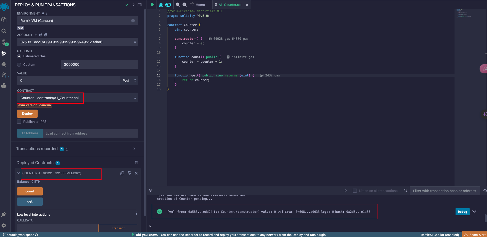
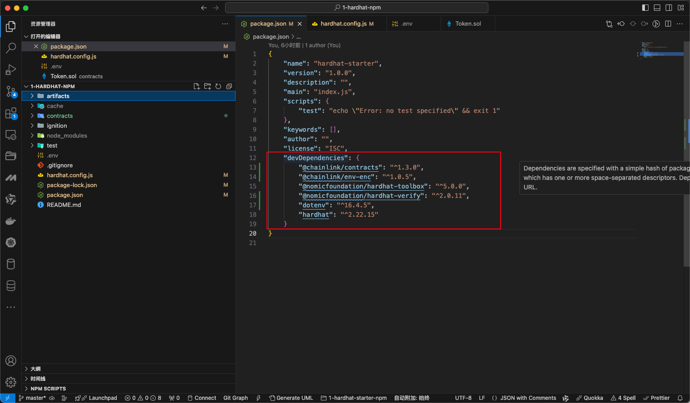

# 1-W1D1-Solidity入门与背景

**目标：了解Solidity的历史和应用领域，安装开发环境**

- Solidity简介与智能合约的历史背景
- Ethereum虚拟机（EVM）工作原理
- 安装与配置开发环境（Remix, VSCode + Hardhat/Truffle）
- Solidity的开发工具学习

# 笔记：

- 1-Solidity简介与智能合约的历史背景
    - Solidity简介
        
        [**Solidity-CN**](https://docs.soliditylang.org/zh/latest/)：
        
        > Solidity是一门为实现智能合约而创建的面向对象的高级编程语言。 智能合约是管理以太坊中账户行为的程序。
        > 
        > 
        > Solidity 是一种面向以太坊虚拟机 (EVM) 的 [带花括号的语言](https://en.wikipedia.org/wiki/List_of_programming_languages_by_type#Curly-bracket_languages)。 它受 C++，Python 和 JavaScript 的影响。 您可以在 [语言的影响因素](https://docs.soliditylang.org/zh/latest/language-influences.html) 部分中找到更多有关 Solidity 受哪些语言启发的细节。
        > 
        > Solidity 是静态类型语言，支持继承，库和复杂的用户自定义的类型以及其他特性。
        > 
        > 使用 Solidity，您可以创建用于投票、众筹、秘密竞价（盲拍）以及多重签名钱包等用途的合约。
        > 
        > 当开发智能合约时，您应该使用最新版本的Solidity。 除某些特殊情况之外，只有最新版本才会收到 [安全修复](https://github.com/ethereum/solidity/security/policy#supported-versions)。 此外，突破性的变化以及新功能会定期引入。 目前，我们使用 0.y.z 版本号 [来表明这种快速的变化](https://semver.org/#spec-item-4)。
        > 
        > **警告**
        > 
        > Solidity最近发布了0.8.x版本，该版本引入了许多重大更新。 请务必阅读 [完整列表](https://docs.soliditylang.org/zh/latest/080-breaking-changes.html)。
        > 
        
        [**Solidity-EN**](https://docs.soliditylang.org/en/latest/)
        
        > Solidity is an object-oriented, high-level language for implementing smart contracts. Smart contracts are programs that govern the behavior of accounts within the Ethereum state.
        > 
        > 
        > *Solidity 是一种面向对象的高级语言，用于实现智能合约。智能合约是控制 Ethereum 状态中账户行为的程序。*
        > 
        > Solidity is a [curly-bracket language](https://en.wikipedia.org/wiki/List_of_programming_languages_by_type#Curly_bracket_languages) designed to target the Ethereum Virtual Machine (EVM). It is influenced by C++, Python, and JavaScript. You can find more details about which languages Solidity has been inspired by in the [language influences](https://docs.soliditylang.org/en/latest/language-influences.html) section.
        > 
        > *Solidity 是一种[大括号语言](https://en.wikipedia.org/wiki/List_of_programming_languages_by_type#Curly_bracket_languages)，旨在针对以太坊虚拟机 （EVM）。它受 C++、Python 和 JavaScript 的影响。您可以在 [language influences](https://docs.soliditylang.org/en/latest/language-influences.html) 部分找到有关 Solidity 受到哪些语言启发的更多详细信息。*
        > 
        > Solidity is statically typed, supports inheritance, libraries, and complex user-defined types, among other features.
        > 
        > *Solidity 是静态类型的，支持继承、库和复杂的用户定义类型等功能。*
        > 
        > With Solidity, you can create contracts for uses such as voting, crowdfunding, blind auctions, and multi-signature wallets.
        > 
        > *使用 Solidity，您可以创建用于投票、众筹、盲拍和多重签名钱包等用途的合约。*
        > 
        > When deploying contracts, you should use the latest released version of Solidity. Apart from exceptional cases, only the latest version receives [security fixes](https://github.com/ethereum/solidity/security/policy#supported-versions). Furthermore, breaking changes, as well as new features, are introduced regularly. We currently use a 0.y.z version number [to indicate this fast pace of change](https://semver.org/#spec-item-4).
        > 
        > *部署合约时，您应该使用最新发布的 Solidity 版本。除特殊情况外，只有最新版本会收到[安全修复](https://github.com/ethereum/solidity/security/policy#supported-versions)程序。此外，还会定期引入重大更改和新功能。我们目前使用 0.y.z 版本号[来表示这种快速的变化](https://semver.org/#spec-item-4)。*
        > 
        > **Warning 警告**
        > 
        > Solidity recently released the 0.8.x version that introduced a lot of breaking changes. Make sure you read [the full list](https://docs.soliditylang.org/en/latest/080-breaking-changes.html).
        > 
        > *Solidity 最近发布了 0.8.x 版本，该版本引入了许多重大更改。请务必阅读[完整列表](https://docs.soliditylang.org/en/latest/080-breaking-changes.html)。*
        > 
    - 智能合约的历史背景
        
        [智能合约-DeCert](https://decert.me/tutorial/solidity/ethereum/evm_core#2%E6%99%BA%E8%83%BD%E5%90%88%E7%BA%A6)
        
        > [智能合约](https://decert.me/tutorial/solidity/ethereum/evm_core#2%E6%99%BA%E8%83%BD%E5%90%88%E7%BA%A6)是以太坊上运行的程序。就像其他计算机程序一样，它由代码和数据组成。智能合约中的数据通常被称为“状态”，因为整个区块链可以看作是所有数据状态的一个确定的记录。
        > 
        > 
        > > 提示:
        > > 
        > > 
        > > 请不要被智能合约名称中的“智能”一词所误导，它与人工智能（AI：Artificial Intelligence）无关。智能合约的概念最早由尼克·萨博提出，**实质上是将法律条款编写成可执行代码，从而使法律执行变得分散化**。这与区块链上的程序无法篡改地执行的理念相契合，因此智能合约成为了区块链的重要概念。
        > > 
        > 
        > 以太坊的智能合约是“[图灵完备](https://zh.wikipedia.org/wiki/%E5%9C%96%E9%9D%88%E5%AE%8C%E5%82%99%E6%80%A7)”的，这意味着理论上我们可以使用它来编写执行任何任务的程序。目前，智能合约的两个主要编程语言是Solidity和Vyper，其中Solidity更为成熟。在本教程中，我们将使用Solidity编写智能合约代码，合约文件的扩展名通常是`.sol`。
        > 
        
        [**智能合约-ethereum**](https://ethereum.org/zh/developers/docs/smart-contracts/)
        
        > **什么是[智能合约](https://ethereum.org/zh/smart-contracts/)？**
        > 
        > 
        > 智能合约只是一个运行在以太坊链上的一个程序。 它是位于以太坊区块链上一个特定地址的一系列代码（函数）和数据（状态）。
        > 
        > 智能合约也是一个[以太坊帐户](https://ethereum.org/zh/developers/docs/accounts/)，我们称之为合约帐户。 这意味着它们有余额，可以成为交易的对象。 但是，他们无法被人操控，他们是被部署在网络上作为程序运行着。 个人用户可以通过提交交易执行智能合约的某一个函数来与智能合约进行交互。 智能合约能像常规合约一样定义规则，并通过代码自动强制执行。 默认情况下，你无法删除智能合约，与它们的交互是不可逆的。
        > 
    - AI回答（智谱清言）：已经认真看完
        
        ### Solidity 简介
        
        Solidity 是一种用于编写以太坊智能合约的编程语言。它采用面向对象的方法和事件驱动架构，旨在为开发者提供一种便捷的方式来创建和部署智能合约，从而推动区块链技术的广泛应用。
        
        ### 历史背景
        
        Solidity 由以太坊创始人 Vitalik Buterin 在 2014 年创建，是基于 JavaScript 的一种编程语言。它的出现极大地简化了智能合约的编写过程，为区块链技术的普及和发展奠定了基础。
        
        ### 特点
        
        1. **面向对象**：Solidity 支持类和继承等面向对象的特性，使代码更模块化和可重用。
        2. **事件驱动**：Solidity 采用事件驱动架构，增强了合约间通信的灵活性和效率。
        3. **安全性**：设计目标是确保智能合约的安全性，通过静态类型检查、不可变性和可预测性等特性降低安全风险。
        
        ### 语法
        
        Solidity 的语法与 JavaScript 类似，但有其特定的关键字和规则。包括：
        
        - 变量声明：支持局部变量、状态变量和映射。
        - 函数定义：支持函数定义和重载。
        - 控制结构：支持常见的控制结构，如 if 语句、循环语句等。
        - 事件处理：支持自定义事件处理函数。
        - 库和依赖项：支持库和依赖项的使用，提高代码的模块化和可重用性。
        
        ### 最佳实践
        
        在使用 Solidity 编写智能合约时，以下最佳实践有助于提高代码质量和安全性：
        
        - 谨慎使用全局变量。
        - 避免使用外部 API，以减少安全风险。
        
        ### 智能合约的历史背景
        
        智能合约是基于区块链技术的自执行合同。它们通常被描述为一种在不需要中介的情况下，当预定的条件被满足时自动执行的协议。
        
        智能合约的概念最早可以追溯到 1990 年代，由密码学家 Nick Szabo 提出并进行阐述。然而，直到以太坊的出现，这一概念才真正得到广泛的应用和发展。以太坊是一个允许开发者创建和部署智能合约的平台，而 Solidity 则是以太坊上最流行的智能合约编程语言。
        
        智能合约通过将合约条款编码在区块链上，确保了其透明性和不可篡改性。这使得智能合约在多种应用场景中都非常有用，包括但不限于金融服务、供应链管理、版权保护和去中心化应用（DApps）。
        
        智能合约的一个重要特点是，一旦部署到区块链上，它们就不可更改。这种不可篡改性确保了合约条款的执行是自动且不可逆转的，从而为各种在线交易和协议提供了额外的信任层。
        
        综上所述，Solidity 和智能合约的结合不仅为开发者提供了强大的工具，也在很大程度上推动了区块链技术的创新和应用。
        
        > 智能合约如何保证不可篡改性？
        > 
        > 
        > 智能合约的不可篡改性是通过以下几个关键机制来保证的：
        > 
        > 1. **区块链结构**：区块链是一个分布式账本，由一系列按时间顺序排列的“区块”组成。每个区块包含一系列交易，并且每个新区块都会引用前一个区块，形成一种链式结构。这种结构使得一旦数据被写入区块链，就很难对其进行修改，因为修改任何一个区块都需要重新计算该区块及其后所有区块的哈希值，这在计算上是不切实际的。
        > 2. **加密哈希函数**：区块链使用加密哈希函数来确保数据的完整性。每个区块都有一个唯一的哈希值，这个值是由区块中的所有交易数据计算得出的。如果区块中的任何数据被篡改，那么该区块的哈希值将会改变，从而与链中后续区块的哈希值不匹配，导致整个链的有效性被破坏。
        > 3. **共识机制**：区块链网络中的节点通过共识机制来达成一致，决定哪些交易被包含在新的区块中，以及区块链的状态。常见的共识机制有工作量证明（Proof of Work, PoW）和权益证明（Proof of Stake, PoS）。这些机制确保了网络中的大多数节点都遵循同一规则，从而防止了任何单一节点对区块链数据的篡改。
        > 4. **去中心化**：区块链网络是去中心化的，意味着没有单一的中心点或权威机构控制整个网络。数据分布在网络中的多个节点上，每个节点都保存着区块链的完整副本。因此，要篡改数据，攻击者需要同时控制网络中超过一半的节点，这在大型网络中几乎是不可能的。
        > 5. **智能合约的不可变性**：一旦智能合约被部署到区块链上，其代码就被视为不可变的。这意味着合约的代码和状态将一直保持不变，除非合约中明确包含了自我修改的机制。这种不可变性确保了合约的执行将按照最初设定的规则进行。
        > 通过这些机制，智能合约能够在不需要第三方信任机构的情况下，提供一种安全、透明且自动执行合同条款的方式。这也是智能合约在区块链技术中如此重要的原因之一。
        
        参考资料：
        
        - Solidity：[契约型编程语言的深度解析](https://cloud.baidu.com/article/2992599) - [百度开发者中心](https://developer.baidu.com/article/detail.html?id=2992599)
        - [智能合约介绍 — Solidity中文文档 — 登链社区](https://learnblockchain.cn/docs/solidity/introduction-to-smart-contracts.html)
- 2-Ethereum虚拟机（EVM）工作原理
    - [以太坊虚拟机（EVM）-DeCert](https://decert.me/tutorial/solidity/ethereum/evm_core#6%E4%BB%A5%E5%A4%AA%E5%9D%8A%E8%99%9A%E6%8B%9F%E6%9C%BAevm)
        
        > EVM（以太坊虚拟机）是一种虚拟计算机，用于执行以太坊区块链上的智能合约和去中心化应用程序。EVM是以太坊的核心组件之一，它负责处理和执行智能合约的代码。
        > 
        > 
        > EVM的工作原理与传统的计算机虚拟机类似，但它是专门为区块链和智能合约而设计的。智能合约是以太坊上的自动化合同，其代码在EVM上运行，并且可以执行各种任务，例如转移加密货币资金、管理数字资产、实施投票机制等。
        > 
        > EVM执行智能合约时，会将智能合约的字节码加载到内存中，然后按照预定的规则执行该字节码。EVM提供了一种安全的执行环境，以确保合约的正确执行，同时还实施了燃气（Gas）的概念，以防止恶意代码无限循环或耗尽计算资源。
        > 
        > 拓展：[**EVM 兼容链及网络-DeCert**](https://decert.me/tutorial/solidity/ethereum/evm_network)
        > 
    - [**以太坊虚拟机 (EVM)-Ethereum**](https://ethereum.org/zh/developers/docs/evm/)
        
        > 以太坊虚拟机 (EVM) 是一个去中心化虚拟环境，它在所有以太坊节点上一种安全一致地方式执行代码。 节点运行以太坊虚拟机，以执行智能合约，利用“[燃料](https://ethereum.org/zh/gas/)”度量执行[操作](https://ethereum.org/zh/developers/docs/evm/opcodes/)所需的计算工作，从而确保高效的资源分配和网络安全性。
        > 
    - AI回答（智谱清言）
        
        Ethereum虚拟机（EVM）是以太坊区块链的核心组成部分，它负责执行智能合约中的代码。以下是EVM的工作原理：
        
        ### 1. EVM的设计理念
        
        EVM的设计灵感来源于传统的虚拟机，但其主要目的是在分布式网络上提供一个安全、隔离的环境来执行代码。它确保了即使在不受信任的环境中，智能合约的执行也是确定性的、可预测的。
        
        ### 2. EVM的结构
        
        - **栈**：EVM使用一个基于栈的架构，这意味着它处理数据的方式是通过栈操作。所有的计算都是在栈上进行的。
        - **内存**：除了栈，EVM还有一块可扩展的内存区域，用于存储执行期间的数据。
        - **存储**：每个智能合约都有自己的持久化存储空间，用于存储合约的状态。
        - **指令集**：EVM有一套预定义的操作码（opcode），这些操作码对应于不同的计算操作。
        
        ### 3. 工作原理
        
        - **部署合约**：当用户或开发者想要部署一个智能合约到以太坊网络时，他们会将编译后的合约代码（通常是以字节码的形式）和部署交易一起发送到网络。
        - **执行交易**：当一个交易被发送到智能合约时，它会被网络中的矿工（或验证者）包含在一个区块中，并执行以下步骤：
            - **验证交易**：矿工验证交易的签名和发送者的余额是否足够支付交易费用。
            - **执行合约代码**：EVM根据交易中的数据执行智能合约的字节码。这包括从栈操作到内存和存储的读写。
            - **状态改变**：合约执行可能会导致以太坊网络的状态发生变化，比如余额的增减或合约存储的改变。
            - **费用计算**：EVM执行每一条指令都会消耗一定的Gas（一种用于计量执行计算步骤的货币单位）。如果交易消耗的Gas超过了发送者设定的限制，交易将被视为无效，并且状态改变将被回滚。
        - **结果和日志**：合约执行的结果（成功或失败）以及任何指定的日志信息将被记录在区块链上。成功执行的交易将导致状态改变被永久记录，而失败的交易则不会影响网络状态。
        
        ### 4. 安全性和确定性
        
        - **沙箱环境**：EVM提供了一个沙箱环境，合约代码在其中执行时不会影响到外部世界或EVM之外的状态。
        - **确定性执行**：EVM的操作码和执行模型被设计为确定性的，这意味着给定相同的输入，所有节点都会产生相同的输出。
        通过这种方式，EVM为以太坊提供了一个去中心化的、安全的平台来执行智能合约，这是实现去中心化应用（DApps）和去中心化金融（DeFi）服务的基础。
- 3-安装与配置开发环境（Remix, VSCode + Hardhat/Truffle）
    
    [**Remix IDE**](https://decert.me/tutorial/solidity/tools/remix)
    
    > 部署一个Counter合约
    > 
    > 
    > 
    > 
    
    [VSCode + Hardhat/Truffle](https://decert.me/tutorial/solidity/tools/hardhat)
    
    > VSCode+Hardhat
    > 
    > 
    > 备注：使用 `hardhat-shorthand` 简写命令 `npx hardhat`
    > 
    > ```bash
    > npm install --global hardhat-shorthand
    > 
    > hh compile   # 等价于 npx hardhat compile
    > hh test      # 等价于 npx hardhat test
    > hh run       # 等价于 npx hardhat run
    > ```
    > 
    > 
    > 
- 4-Solidity的开发工具学习
    - [x]  [**MetaMask 钱包**](https://decert.me/tutorial/solidity/tools/metamask)
    - [x]  [Remix IDE](https://decert.me/tutorial/solidity/tools/remix)
    - [x]  [Truffle 开发框架](https://decert.me/tutorial/solidity/tools/truffle_ganache) ——（仅阅读了解）
    - [x]  [Hardhat 开发框架](https://decert.me/tutorial/solidity/tools/hardhat)
    - [x]  [Foundry 开发框架](https://decert.me/tutorial/solidity/tools/foundry) ——（仅阅读了解）