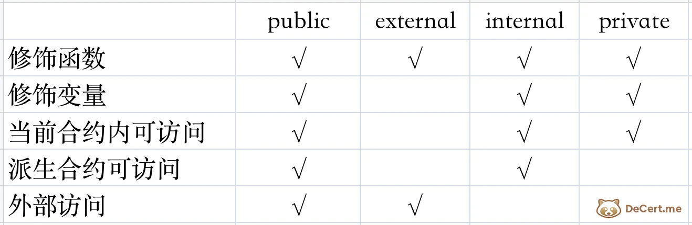

# 2-W1D2-基础语法（1）

**目标：掌握Solidity的基础数据类型与变量**

- 数据类型（uint, int, bool, address, bytes）
- 变量声明与作用域
- 常量和不可变变量（constant, immutable）
- 数据的存储位置（storage, memory, calldata）

# 笔记

- 基础前提
    
    # [**数据类型**](https://decert.me/tutorial/solidity/solidity-basic/types)
    
    Solidity 是一门静态类型语言，和常见的静态类型语言有C、C++、Java类似，需要在编码时为每个变量（本地或状态变量）指定类型。Solidity 提供了几种基本类型：
    
    ## **类型分类[​](https://decert.me/tutorial/solidity/solidity-basic/types#%E7%B1%BB%E5%9E%8B%E5%88%86%E7%B1%BB)**
    
    Solidity 类型分：
    
    - 值类型（Value Types）
    - 引用类型（Reference Types）
    - 映射类型（Mapping Types）
        
        > [**值类型](https://decert.me/tutorial/solidity/solidity-basic/types#%E5%80%BC%E7%B1%BB%E5%9E%8B)：值类型变量用表示可以用32个字节表示的数据，在赋值或传参时，总是进行拷贝。**
        > 
        > 
        > [**引用类型](https://decert.me/tutorial/solidity/solidity-basic/types#%E5%BC%95%E7%94%A8%E7%B1%BB%E5%9E%8B)：**引用类型用来表示复杂类型，占用的空间超过32字节，拷贝时开销很大，因此可以使用引用的方式，通过多个不同名称的变量指向一个值。引用类型包括**数组** 和**结构体**。
        > 
        > [**映射类型](https://decert.me/tutorial/solidity/solidity-basic/types#%E6%98%A0%E5%B0%84%E7%B1%BB%E5%9E%8B)：**映射类型和Java的Map、Python的Dict在功能上差不多，它是一种键值对的映射关系存储结构，定义方式为mapping(KT => KV)。
        > 
    
    ### **值类型[​](https://decert.me/tutorial/solidity/solidity-basic/types#%E5%80%BC%E7%B1%BB%E5%9E%8B)**
    
    值类型变量用表示可以用32个字节表示的数据，在赋值或传参时，总是进行拷贝。
    
    值类型包含：
    
    - 布尔类型（Booleans）
    - [整型（Integers）](https://decert.me/tutorial/solidity/solidity-basic/int)
    - 定长浮点型（Fixed Point Numbers）
    - 定长字节数组（Fixed-size byte arrays）
    - 有理数和整型常量（Rational and Integer Literals)
    - 字符串常量（String literals）
    - 十六进制常量（Hexadecimal literals）
    - 枚举（Enums）
    - 函数类型（Function Types）
    - [地址类型（Address)](https://decert.me/tutorial/solidity/solidity-basic/address)
    - 地址常量（Address Literals）
    - 用户定义值类型
    
    对于public类型的状态变量，Solidity 编译器还会自动创建一个访问器函数，这是一个与状态变量名字相同的函数，用来获取状态变量的值（不用再额外写函数来获取变量的值）。
    
    ### **引用类型[​](https://decert.me/tutorial/solidity/solidity-basic/types#%E5%BC%95%E7%94%A8%E7%B1%BB%E5%9E%8B)**
    
    引用类型用来表示复杂类型，占用的空间超过32字节，拷贝时开销很大，因此可以使用引用的方式，通过多个不同名称的变量指向一个值。引用类型包括**数组** 和**结构体**。
    
    在定义引用类型时，有一个额外属性来标识数据的存储位置，这个属性有：
    
    - memory（内存）： 变量在运行时存在，其生命周期只存在于函数调用期间。
    - storage（存储）：保存状态变量，只要合约存在就一直保存在区块链中。
    - calldata（调用数据）：用来存储函数参数的特殊数据位置，用来接收外部数据，是一个不可修改的、非持久的函数参数存储区域。
    
    记住一个规则：**不同引用类型在进行赋值的时候，只有在不同的数据位置赋值时会进行一份拷贝，而在同一数据位置内通常是增加一个引用**。
    
    ```solidity
    pragma solidity >=0.4.0 <0.7.0;
    
    contract Tiny {
        uint[] x;// 状态变量 x 的数据存储位置是 storage
    
        function f(uint[] memory memoryArray) public {
            x = memoryArray;// 数组拷贝到storage中， 因为 memory 变量赋值给 storage。
            uint[] storage y = x;// 仅分配一个指针（x y 指向同一个位置），
        }
    
    }
    
    ```
    
    不同的数据位置的gas消耗时不一样的：
    
    - 存储（storage）会在永久保存合约状态变量，开销最大。
    - 内存（memory）仅保存临时变量，函数调用之后释放，开销很小。
    - 调用数据（**calldata）** 最便宜。
    
    ### **映射类型[​](https://decert.me/tutorial/solidity/solidity-basic/types#%E6%98%A0%E5%B0%84%E7%B1%BB%E5%9E%8B)**
    
    映射类型和Java的Map、Python的Dict在功能上差不多，它是一种键值对的映射关系存储结构，定义方式为mapping(KT => KV)。
    
- 数据类型（uint, int, bool, address, bytes）
    - 答案
        1. `int` / `uint`
            
            `int` / `uint`: 分别表示有符号和无符号的不同位数的整型变量。 关键字 `uint8` 到 `uint256` （无符号整型，从 8 位到 256 位）以及 `int8` 到 `int256`， 以 8 位为步长递增。 `uint` 和 `int` 分别是 `uint256` 和 `int256` 的别名。
            
            **当没有为整型变量赋值时，会使用默认值 0。**
            
            > 提示
            > 
            > 
            > 在 Solidity 0.8版本之前， 如果整数运算结果不在取值范围内，则会被溢出截断。
            > 
            > 从 0.8.0 开始，算术运算有两个计算模式：一个是 unchecked（不检查）模式，一个是”checked” （检查）模式。
            > 
            > 默认情况下，算术运算在 “checked” 模式下，即都会进行溢出检查，如果结果落在取值范围之外，调用会通过 [失败异常](https://learnblockchain.cn/docs/solidity/control-structures.html#assert-and-require) 回退。 你也可以通过 `unchecked { ... }` 切换到 “unchecked”模式，更多可参考文档 [unchecked](https://learnblockchain.cn/docs/solidity/control-structures.html#unchecked) 。
            > 
            
            > 信息
            > 
            > 
            > 当我们确定一个运算不会发生溢出时，使用 `unchecked` 模式，有[更高的 GAS 效率](https://decert.me/tutorial/solidity/solidity-basic/int#%E5%85%B3%E6%B3%A8-gas)。
            > 
            
            > 几点说明：
            > 
            > 1. 整型变量除法总是会截断取整，但是整型常量不会截断。
            > 2. 整数除 0 会抛出异常。
            > 
            > 还可以通过变量的的类型，获取的取值范围，例如：对于整形 `X`，可以使用 `type(X).min` 和 `type(X).max` 去获取这个类型的最小值与最大值。
            > 
        2. `bool` 
            
            `bool` ：可能的取值为常数值 `true` 和 `false`。
            
            运算符：
            
            - `!` (逻辑非)
            - `&&` (逻辑与, "and")
            - `||` (逻辑或, "or")
            - `==` (等于)
            - `!=` (不等于)
            
            运算符 `||` 和 `&&` 都遵循同样的短路（ short-circuiting ）规则。 就是说在表达式 `f(x) || g(y)` 中， 如果 `f(x)` 的值为 `true` ， 那么 `g(y)` 就不会被执行，即使会出现一些副作用。
            
        3. `address`
            
            **账户与地址[](https://decert.me/tutorial/solidity/solidity-basic/address#%E8%B4%A6%E6%88%B7%E4%B8%8E%E5%9C%B0%E5%9D%80)**
            
            Solidity 合约程序里，使用**地址类型**来表示我们的账号，如下在合约中，获取了用户地址，保存在地址类型（address）中：
            
            ```solidity
            contract testAddr {
              address public user;
                function getUserAddress() public {
                    user = msg.sender;
                }
            }
            ```
            
            地址类型有两种：
            
            - `address`：保存一个20字节的值（以太坊地址的大小）。
            - `address payable`：表示可支付地址（可接受以太币的地址），在地址格式上，其实与`address` 完全相同，也是20字节。
            
            > 备注
            > 
            > 
            > 那为什么要使用 `address` 和 `address payable` 两种类型呢？
            > 
            > 如果不做区分，当我们把 ETH 转到一个地址上时，恰巧如果后者是一个合约地址（即[合约账户](https://decert.me/tutorial/solidity/ethereum/evm_core#%E8%B4%A6%E6%88%B7)）又没有处理ETH的逻辑，那么 ETH 将永远锁死在该合约地址上，任何人都无法提取和使用它。
            > 
            > 因此，需要做此区分，显示的表达，一个地址可以接受ETH， 表示其有处理ETH的逻辑(EOA 账户本身可转账ETH)。
            > 
            
            `address` 和 `address payable` 两种类型尽管格式一样，但`address payable`拥有的两个成员函数`transfer`和`send` （`address` 没有这两个方法），`transfer`和`send` 的作用是向该地址转账，下文会进一步介绍。
            
            在编写合约时，大部分时候，使用`address`就好，当需要向地址转账时，可以使用以下代码把`address` 转换为`address payable` ：
            
            ```solidity
            address payable ap = payable(addr);
            ```
            
            ## **对地址转账及获取地址余额[​](https://decert.me/tutorial/solidity/solidity-basic/address#%E5%AF%B9%E5%9C%B0%E5%9D%80%E8%BD%AC%E8%B4%A6%E5%8F%8A%E8%8E%B7%E5%8F%96%E5%9C%B0%E5%9D%80%E4%BD%99%E9%A2%9D)**
            
            地址类型还有一些成员函数属性及函数，因此地址类型在表现上还类似面向对象语言的中的类（内置类）， 最常使用的是余额属性与转账函数：
            
            1. `addr.balance` 属性 : 返回地址的余额， 余额以wei为单位 (uint256)。
            2. `addr_payable.transfer(uint256 amount)` : 用来向地址发送`amount`数量以太币(wei)，transfer 函数只使用固定的 2300 gas , 发送失败时抛出异常。
            3. `addr_payable.send(uint256 amount) returns (bool)`: `send` 功能上和`transfer` 函数一样，同样使用固定的 2300 gas , 但是在发送失败时不抛出异常，而是返回`false`。
            
            > 备注
            > 
            > 
            > 你也许发现了 `addr.transfer(y)`与`require(addr.send(y))` 是等价的， 对的。
            > 
            > send是transfer的低级版本。如果执行失败，当前的合约不会因为异常而终止， 而在使用 send 的时候，如果不检查返回值，就会有额外风险， 编写智能合约风险真是无处不在呀。
            > 
        4. `bytes`
            
            ## **string 和 bytes[​](https://decert.me/tutorial/solidity/solidity-basic/array#string-%E5%92%8C-bytes)**
            
            还有两个特殊的数组类型：**string** 和 **bytes** 。
            
            `string` 是一个字符串，可以认为是一个字符数组， `string` 不支持数组的 `push` `pop` 方法。
            
            `bytes` 是动态分配大小字节的数组，类似于byte[]，但是bytes的gas费用更低。bytes 也可以用来表达字符串， 但通常用于原始字节数据。bytes 支持数组的 `push` `pop` 方法。
            
            **string** 和 **bytes** 的声明几乎是一样的，形式如下：
            
            ```solidity
            contract testStringBytes {
                bytes bs;
                bytes bs0 = "12abcd";
                bytes bs1 = "abc\x22\x22";// 十六进制数
                bytes bs2 = "Tiny\u718A";// 718A为汉字“熊”的Unicode编码值
            
                string str1 = "TinyXiong";
            
                string name;
                function setName(string calldata _name) public {
                    name = _name;
                }
            }
            ```
            
            **注意**：bytes和string 都不支持用下标索引进行访问某个元素。
            
            如果使用一个长度有限制的字节数组，应该使用一个`bytes1`到`bytes32`的具体类型，因为它们占用空间更少，消耗的gas更低。
            
            Solidity 语言本身提供的`string`功能比较弱，并没有提供一些实用函数，如获取字符串长度、获得子字符串、大小写转换、字符串拼接等函数。这些功能有第三方的库实现，在使用时，我们要心理有数：Solidity 处理字符串是gas不够高效的。
            
            > [**定长字节数组**](https://docs.soliditylang.org/zh/latest/types.html#index-7)
            > 
            > 
            > 值类型 `bytes1`, `bytes2`, `bytes3`, ..., `bytes32` 代表从1到32的字节序列。
            > 
            > 成员变量：
            > 
            > - `.length` 表示这个字节数组的长度（只读）.
            > 
            > > **备注**
            > > 
            > > 
            > > 类型 `bytes1[]` 是一个字节数组，但是由于填充规则，它为每个元素浪费了31个字节的空间（在存储中除外）。 因此最好使用 `bytes` 类型来代替。
            > > 
            > 
            > [**变长字节数组**](https://docs.soliditylang.org/zh/latest/types.html#id17)
            > 
            > **`bytes`:**变长字节数组，参见 [数组](https://docs.soliditylang.org/zh/latest/types.html#arrays)。它并不是值类型！
            > 
            > **`string`:**变长 UTF-8 编码字符串类型，参见 [数组](https://docs.soliditylang.org/zh/latest/types.html#arrays)。并不是值类型！
            > 
            
    - 拓展
        
        在Solidity中，值类型是那些在函数调用时总是被复制的数据类型。以下是对每种值类型的含义、使用场景和示例的详细说明：
        
        - 布尔类型（Booleans）
            - **含义**：布尔类型表示逻辑值 true 或 false。
            - **使用场景**：用于条件判断和逻辑运算。
            - **示例**：
                
                ```solidity
                bool public isTrue = true;
                if (isTrue) {
                    // 执行某些操作
                }
                ```
                
        - 整型（Integers）
            - **含义**：整型表示整数，有不同的大小和符号（无符号和有符号）。
            - **使用场景**：用于表示数量、索引、计算等。
            - **示例**：
                
                ```solidity
                uint256 public myUint = 123; // 无符号整型
                int256 public myInt = -123; // 有符号整型
                ```
                
        - 定长浮点型（Fixed Point Numbers）
            - **含义**：表示固定小数点的数字，但Solidity没有原生支持，需要通过库实现。
            - **使用场景**：用于需要高精度小数的金融合约等。
            - **示例**：由于Solidity原生不支持，没有直接示例。
        - 定长字节数组（Fixed-size byte arrays）
            - **含义**：表示固定长度的字节数组。
            - **使用场景**：用于存储固定大小的数据，如哈希值。
            - **示例**：
                
                ```solidity
                bytes32 public myHash = 0x1234567890abcdef1234567890abcdef1234567890abcdef1234567890abcdef;
                ```
                
        - 有理数和整型常量（Rational and Integer Literals）
            - **含义**：表示整数值和分数值，可以直接在代码中使用。
            - **使用场景**：用于直接赋值或计算。
            - **示例**：
                
                ```solidity
                uint256 public one = 1;
                uint256 public oneHalf = 1/2; // 结果为0，因为Solidity不支持分数，除非使用库
                ```
                
        - 字符串常量（String literals）
            - **含义**：表示一系列字符。
            - **使用场景**：用于存储文本信息。
            - **示例**：
                
                ```solidity
                string public myString = "Hello, World!";
                ```
                
        - 十六进制常量（Hexadecimal literals）
            - **含义**：以0x开头的十六进制表示的数值。
            - **使用场景**：用于表示字节或地址。
            - **示例**：
                
                ```solidity
                bytes32 public myHex = 0x12345678;
                ```
                
        - 枚举（Enums）
            - **含义**：用户定义的类型，可以赋值为一组命名的常量。
            - **使用场景**：用于表示一组预定义的值。
            - **示例**：
                
                ```solidity
                enum State { Created, Locked, Inactive }
                State public state = State.Created;
                ```
                
        - 函数类型（Function Types）
            - **含义**：表示函数，可以赋值给变量，作为参数传递或从函数返回。
            - **使用场景**：用于定义回调函数、代理合约等。
            - **示例**：
                
                ```solidity
                function myFunction(uint x) external pure returns (uint) {
                    return x * 2;
                }
                ```
                
        - 地址类型（Address）
            - **含义**：表示以太坊区块链上的账户地址。
            - **使用场景**：用于发送以太币、调用合约函数等。
            - **示例**：
                
                ```solidity
                address public owner = 0x1234567890123456789012345678901234567890;
                ```
                
        - 地址常量（Address Literals）
            - **含义**：以特定格式表示的地址常量。
            - **使用场景**：用于直接赋值地址。
            - **示例**：
                
                ```solidity
                address public myAddress = address(0x1234567890123456789012345678901234567890);
                ```
                
        - 用户定义值类型
            - **含义**：通过使用enum或struct等关键字定义的类型。
            - **使用场景**：用于创建复杂的类型和数据结构。
            - **示例**：
                
                ```solidity
                struct User {
                    string name;
                    uint256 age;
                }
                User public user = User({name: "Alice", age: 30});
                ```
                
                在Solidity中，`enum` 是一种用户定义的类型，它允许开发者创建一组命名的常量。这些常量可以是整型值，但是它们的名字在合约中更加具有可读性。以下是关于 `enum` 的详细信息：
                
                ### 含义
                
                - `enum` 是一种用户定义的类型，用于定义一组命名的常量集合。
                - 在声明时，`enum` 中的第一个元素默认赋值为 0，其余元素按顺序递增。
                
                ### 使用场景
                
                - 当你需要一组预定义的状态或选项时，使用 `enum` 可以提高代码的可读性和维护性。
                - `enum` 常用于表示合约状态、订单状态、权限级别等。
                
                ### 示例
                
                以下是一个使用 `enum` 的示例，该示例定义了一个名为 `State` 的 `enum`，表示一个简单的状态机：
                
                ```solidity
                pragma solidity ^0.8.0;
                contract EnumExample {
                    // 定义一个名为 State 的 enum 类型
                    enum State { Created, Locked, Inactive }
                    // 声明一个 State 类型的变量
                    State public state;
                    // 构造函数，初始化状态为 Created
                    constructor() {
                        state = State.Created;
                    }
                    // 一个修改状态的方法
                    function lock() public {
                        state = State.Locked;
                    }
                    // 另一个修改状态的方法
                    function deactivate() public {
                        state = State.Inactive;
                    }
                    // 根据当前状态返回字符串描述
                    function getStateDescription() public view returns (string memory) {
                        if (state == State.Created) {
                            return "State is Created";
                        } else if (state == State.Locked) {
                            return "State is Locked";
                        } else if (state == State.Inactive) {
                            return "State is Inactive";
                        } else {
                            return "Unknown state";
                        }
                    }
                }
                
                ```
                
                在这个示例中，我们定义了一个 `enum` 类型 `State`，它有三个可能的值：`Created`、`Locked` 和 `Inactive`。我们还定义了一个 `State` 类型的变量 `state`，以及一些方法来修改和查询这个状态。
                `enum` 的值在内部是整数，但是它们在合约外部是不可见的。你可以使用 `uint8` 类型来表示 `enum` 的值，因为在这个示例中 `enum` 的值不会超过 `uint8` 的范围（0 到 255）。如果 `enum` 中的元素超过 256 个，可以使用更大的整数类型如 `uint16`、`uint32` 等。
                请注意，虽然 `enum` 中的值是整数，但是不建议直接使用整数来表示 `enum` 的值，因为这会降低代码的可读性和安全性。始终使用 `enum` 名称来访问和比较值。
                
        
        请注意，Solidity的值类型在函数调用时会复制其值，与引用类型（如数组和映射）不同，后者传递的是引用。
        
- 变量声明与作用域
    - [**变量与函数的可见性-DeCert**](https://decert.me/tutorial/solidity/solidity-basic/solidity_layout#%E5%8F%98%E9%87%8F%E4%B8%8E%E5%87%BD%E6%95%B0%E7%9A%84%E5%8F%AF%E8%A7%81%E6%80%A7)
        - 基础前提
            
            **第一个合约：Counter**
            
            ```solidity
            // 开源协议
            //SPDX-License-Identifier: MIT
            
            // 编译器版本声明
            pragma solidity >=0.8.0;
            
            // 使用 contract 定义合约
            contract Counter {
            		// 定义变量按格式： 变量类型 变量可见性 变量名。
            		// 变量可见性是可选的，没有显示申明可见性时，会使用缺省值 internal。
            		// 未指定时，默认为0。
                uint public counter;
                
                constructor() {
                    counter = 0;
                }
                
                function count() public {
                    counter = counter + 1;
                }
                
                function get() public view returns (uint) {
                    return counter;
                }
            }
            ```
            
        - 变量的可见性
            
            合约（`contract`）和其他语言的类（`class`）很类似，合约添加的变量与函数，也是使用`public` `private`等关键字来控制变量和函数是否可以被外部使用。
            
            如`Counter`合约的如下定义：
            
            ```solidity
            // 变量类型:变量可见性:变量名
            uint public counter;
            ```
            
            使用了 `public` 关键字， 表示 counter 是可以被公开访问的。
            
            除 `public` 之外，还有几个关键字，来修饰属性与函数的可见性。
            
            - Solidity对函数和状态变量提供了4种可见性：`external`、`public`、`internal`、`private`。
                - **public[​](https://decert.me/tutorial/solidity/solidity-basic/solidity_layout#public)**
                    
                    声明为 `public` 的函数或变量，他们既可以在合约内部访问，也以合约接口形式暴露合约外部（其他合约或链下）调用。
                    
                    另外，`public` 类型的状态变量，会自动创建一个同名的外部函数（称为[访问器](https://learnblockchain.cn/docs/solidity/contracts.html#getter-functions)），来获取状态变量的值。
                    
                - **external[​](https://decert.me/tutorial/solidity/solidity-basic/solidity_layout#external)**
                    
                    `external` 不可以修饰状态变量，声明为 `external` 的函数只能在外部调用，因此称为外部函数。
                    
                    如何想在合约内部调用外部函数，需要使用`this.func()` （而不是 `func()`）。
                    
                    下面是一个例子：
                    
                    ```solidity
                    contract Counter {
                        uint a;
                        function add(uint x) external {
                            a = a+x;
                      }
                    
                      function increase() public {
                    // add(1);   // 错误，无法调用
                        this.add(1);// 正确
                      }
                    
                    }
                    
                    ```
                    
                    备注
                    
                    前面有合约地址来调用函数， 即 `addr.fun()` 形式，这个方式称为外部调用。而 `func()`形式为内部调用。
                    
                    外部调用也称为消息调用，会切换上下文。内部调用则是在当前上下文里跳转。
                    
                    所有暴露给外部的函数 （声明为 `external` 和 `public`），构成了合约的对外接口。
                    
                - **internal[​](https://decert.me/tutorial/solidity/solidity-basic/solidity_layout#internal)**
                    
                    声明为 `internal` 函数和状态变量只能在当前合约中调用或者在[派生合约（子合约）](https://decert.me/tutorial/solidity/solidity-basic/is)里访问。
                    
                - **private[​](https://decert.me/tutorial/solidity/solidity-basic/solidity_layout#private)**
                    
                    声明为 `private` 函数和状态变量仅可在当前定义它们的合约中使用，并且不能被[派生合约](https://decert.me/tutorial/solidity/solidity-basic/is)使用。
                    
                - 变量的4种可见性对比表格：
                    
                    
                    
        - **函数的可见性**
            
            > DeCert对**函数的可见性**的描述比较简单，这里放上Solidity的链接
            > 
            
            [**函数的可见性-Solidity-CN**](https://www.notion.so/2-W1D2-1-12f5b6e80ae6806ebadbf100c742d0ae?pvs=21)
            
    - [**可见性和 getter 函数-Solidity**](https://docs.soliditylang.org/zh/latest/contracts.html#getter)
        - 基础前提
            
            ### [**合约**](https://docs.soliditylang.org/zh/latest/contracts.html#contracts)
            
            Solidity中的合约类似于面向对象语言中的类。 它们在状态变量中包含持久的数据，以及可以修改这些变量的函数。 在不同的合约（实例）上调用一个函数将执行一个EVM函数调用， 从而切换上下文，使调用合约中的状态变量无法访问。 任何事情的发生都需要调用合约及其函数。 在以太坊中没有 “定时（cron）” 的概念来在特定事件中自动调用函数。
            
            ### [**创建合约**](https://docs.soliditylang.org/zh/latest/contracts.html#index-1)
            
            可以通过以太坊交易 “从外部” 或从 Solidity 合约内部创建合约。
            
            当一个合约被创建时，它的 [构造函数（constructor）](https://docs.soliditylang.org/zh/latest/contracts.html#constructor) （一个用 `constructor` 关键字声明的函数）被执行一次。
            
            构造函数是可选的。但是只允许有一个构造函数，这意味着不支持重载。
            
            构造函数执行完毕后，合约的最终代码被存储在区块链上。 这段代码包括所有公开和外部函数，以及所有通过函数调用可从那里到达的函数。 **部署的代码不包括构造函数代码**或只从构造函数调用的内部函数。
            
            如果一个合约想创建另一个合约，创建者必须知道所创建合约的源代码（和二进制）。 这意味着，循环的创建依赖是不可能的。
            
            [open in Remix](https://remix.ethereum.org/?#language=solidity&version=0.8.22&code=Ly8gU1BEWC1MaWNlbnNlLUlkZW50aWZpZXI6IEdQTC0zLjAKcHJhZ21hIHNvbGlkaXR5ID49MC40LjIyIDwwLjkuMDsKCgpjb250cmFjdCBPd25lZFRva2VuIHsKICAgIC8vIGBUb2tlbkNyZWF0b3JgIOaYr+WmguS4i+WumuS5ieeahOWQiOe6puexu+Wei+OAggogICAgLy8g5LiN5Yib5bu65paw5ZCI57qm55qE6K+d77yM5Lmf5Y+v5Lul5byV55So5a6D44CCCiAgICBUb2tlbkNyZWF0b3IgY3JlYXRvcjsKICAgIGFkZHJlc3Mgb3duZXI7CiAgICBieXRlczMyIG5hbWU7CgogICAgLy8g6L+Z5piv5rOo5YaMIGNyZWF0b3Ig5ZKM6K6+572u5ZCN56ew55qE5p6E6YCg5Ye95pWw44CCCiAgICBjb25zdHJ1Y3RvcihieXRlczMyIG5hbWVfKSB7CiAgICAgICAgLy8g54q25oCB5Y+Y6YeP6YCa6L+H5YW25ZCN56ew6K6/6Zeu77yMCiAgICAgICAgLy8g6ICM5LiN5piv6YCa6L+H5L6L5aaCIGB0aGlzLm93bmVyYCDnmoTmlrnlvI/orr/pl67jgIIKICAgICAgICAvLyDlh73mlbDlj6/ku6Xnm7TmjqXmiJbpgJrov4cgYHRoaXMuZmAg6K6/6Zeu44CCCiAgICAgICAgLy8g5L2G5ZCO6ICF5o+Q5L6b5LqG5LiA5Liq5a+55Ye95pWw55qE5aSW6YOo5Y+v6KeG5pa55rOV44CCCiAgICAgICAgLy8g54m55Yir5piv5Zyo5p6E6YCg5Ye95pWw5Lit77yM5oKo5LiN5bqU6K+l5LuO5aSW6YOo6K6/6Zeu5Ye95pWw77yMCiAgICAgICAgLy8g5Zug5Li66K+l5Ye95pWw6L+Y5LiN5a2Y5Zyo44CCCiAgICAgICAgLy8g6K+m6KeB5LiL5LiA6IqC44CCCiAgICAgICAgb3duZXIgPSBtc2cuc2VuZGVyOwoKICAgICAgICAvLyDmiJHku6zov5vooYzkuobku44gYGFkZHJlc3NgIOWIsCBgVG9rZW5DcmVhdG9yYCDnmoTmmL7lvI/nsbvlnovovazmjaLvvIwKICAgICAgICAvLyDlubblgYflrprosIPnlKjlkIjnuqbnmoTnsbvlnovmmK8gYFRva2VuQ3JlYXRvcmDvvIwKICAgICAgICAvLyDmsqHmnInnnJ/mraPnmoTmlrnms5XmnaXpqozor4HvvIwKICAgICAgICAvLyDov5nlubbmsqHmnInliJvlu7rkuIDkuKrmlrDnmoTlkIjnuqbjgIIKICAgICAgICBjcmVhdG9yID0gVG9rZW5DcmVhdG9yKG1zZy5zZW5kZXIpOwogICAgICAgIG5hbWUgPSBuYW1lXzsKICAgIH0KCiAgICBmdW5jdGlvbiBjaGFuZ2VOYW1lKGJ5dGVzMzIgbmV3TmFtZSkgcHVibGljIHsKICAgICAgICAvLyDlj6rmnInliJvlu7rogIXlj6/ku6XmlLnlj5jlkI3np7DjgIIKICAgICAgICAvLyDmiJHku6zmoLnmja7lkIjnuqbnmoTlnLDlnYDov5vooYzmr5TovoPvvIwKICAgICAgICAvLyDlroPlj6/ku6XpgJrov4fmmL7lvI/ovazmjaLkuLrlnLDlnYDmnaXmo4DntKLjgIIKICAgICAgICBpZiAobXNnLnNlbmRlciA9PSBhZGRyZXNzKGNyZWF0b3IpKQogICAgICAgICAgICBuYW1lID0gbmV3TmFtZTsKICAgIH0KCiAgICBmdW5jdGlvbiB0cmFuc2ZlcihhZGRyZXNzIG5ld093bmVyKSBwdWJsaWMgewogICAgICAgIC8vIOWPquacieW9k+WJjeaJgOacieiAheaJjeiDveWPkemAgSB0b2tlbuOAggogICAgICAgIGlmIChtc2cuc2VuZGVyICE9IG93bmVyKSByZXR1cm47CgogICAgICAgIC8vIOaIkeS7rOmAmui/h+S9v+eUqOS4i+mdouWumuS5ieeahCBgVG9rZW5DcmVhdG9yYCDlkIjnuqbnmoTkuIDkuKrlh73mlbAKICAgICAgICAvLyDmnaXor6Lpl67liJvlu7rogIXlkIjnuqbmmK/lkKblupTor6Xov5vooYzovaznp7vjgIIKICAgICAgICAvLyDlpoLmnpzosIPnlKjlpLHotKXvvIjkvovlpoLnlLHkuo7msJTkvZPlgLzogJflsL3vvInvvIwKICAgICAgICAvLyDov5nph4znmoTmiafooYzkuZ/kvJrlpLHotKXjgIIKICAgICAgICBpZiAoY3JlYXRvci5pc1Rva2VuVHJhbnNmZXJPSyhvd25lciwgbmV3T3duZXIpKQogICAgICAgICAgICBvd25lciA9IG5ld093bmVyOwogICAgfQp9CgoKY29udHJhY3QgVG9rZW5DcmVhdG9yIHsKICAgIGZ1bmN0aW9uIGNyZWF0ZVRva2VuKGJ5dGVzMzIgbmFtZSkKICAgICAgICBwdWJsaWMKICAgICAgICByZXR1cm5zIChPd25lZFRva2VuIHRva2VuQWRkcmVzcykKICAgIHsKICAgICAgICAvLyDliJvlu7rkuIDkuKrmlrDnmoQgYFRva2VuYCDlkIjnuqblubbov5Tlm57lhbblnLDlnYDjgIIKICAgICAgICAvLyDku45KYXZhU2NyaXB05pa56Z2i5p2l55yL77yMCiAgICAgICAgLy8g6L+Z5Liq5Ye95pWw55qE6L+U5Zue57G75Z6L5pivIGBhZGRyZXNzYO+8jAogICAgICAgIC8vIOWboOS4uui/meaYr0FCSeS4reacgOaOpei/keeahOexu+Wei+OAggogICAgICAgIHJldHVybiBuZXcgT3duZWRUb2tlbihuYW1lKTsKICAgIH0KCiAgICBmdW5jdGlvbiBjaGFuZ2VOYW1lKE93bmVkVG9rZW4gdG9rZW5BZGRyZXNzLCBieXRlczMyIG5hbWUpIHB1YmxpYyB7CiAgICAgICAgLy8g5ZCM5qC377yMYHRva2VuQWRkcmVzc2Ag55qE5aSW6YOo57G75Z6L5piv566A5Y2V55qEIGBhZGRyZXNzYOOAggogICAgICAgIHRva2VuQWRkcmVzcy5jaGFuZ2VOYW1lKG5hbWUpOwogICAgfQoKICAgIC8vIOaJp+ihjOajgOafpe+8jOS7peehruWumuaYr+WQpuW6lOivpeWwhuS7o+W4gei9rOenu+WIsCBgT3duZWRUb2tlbmAg5ZCI57qm5LiK44CCCiAgICBmdW5jdGlvbiBpc1Rva2VuVHJhbnNmZXJPSyhhZGRyZXNzIGN1cnJlbnRPd25lciwgYWRkcmVzcyBuZXdPd25lcikKICAgICAgICBwdWJsaWMKICAgICAgICBwdXJlCiAgICAgICAgcmV0dXJucyAoYm9vbCBvaykKICAgIHsKICAgICAgICAvLyDmo4Dmn6XkuIDkuKrku7vmhI/nmoTmnaHku7bvvIznnIvmmK/lkKblupTor6Xov5vooYzovaznp7vjgIIKICAgICAgICByZXR1cm4ga2VjY2FrMjU2KGFiaS5lbmNvZGVQYWNrZWQoY3VycmVudE93bmVyLCBuZXdPd25lcikpWzBdID09IDB4N2Y7CiAgICB9Cn0=)
            
            ```solidity
            // SPDX-License-Identifier: GPL-3.0
            pragma solidity >=0.4.22 <0.9.0;
            
            contract OwnedToken {
                // `TokenCreator` 是如下定义的合约类型。
                // 不创建新合约的话，也可以引用它。
                TokenCreator creator;
                address owner;
                bytes32 name;
            
                // 这是注册 creator 和设置名称的构造函数。
                constructor(bytes32 name_) {
                    // 状态变量通过其名称访问，
                    // 而不是通过例如 `this.owner` 的方式访问。
                    // 函数可以直接或通过 `this.f` 访问。
                    // 但后者提供了一个对函数的外部可视方法。
                    // 特别是在构造函数中，您不应该从外部访问函数，
                    // 因为该函数还不存在。
                    // 详见下一节。
                    owner = msg.sender;
            
                    // 我们进行了从 `address` 到 `TokenCreator` 的显式类型转换，
                    // 并假定调用合约的类型是 `TokenCreator`，
                    // 没有真正的方法来验证，
                    // 这并没有创建一个新的合约。
                    creator = TokenCreator(msg.sender);
                    name = name_;
                }
            
                function changeName(bytes32 newName) public {
                    // 只有创建者可以改变名称。
                    // 我们根据合约的地址进行比较，
                    // 它可以通过显式转换为地址来检索。
                    if (msg.sender == address(creator))
                        name = newName;
                }
            
                function transfer(address newOwner) public {
                    // 只有当前所有者才能发送 token。
                    if (msg.sender != owner) return;
            
                    // 我们通过使用下面定义的 `TokenCreator` 合约的一个函数
                    // 来询问创建者合约是否应该进行转移。
                    // 如果调用失败（例如由于气体值耗尽），
                    // 这里的执行也会失败。
                    if (creator.isTokenTransferOK(owner, newOwner))
                        owner = newOwner;
                }
            }
            
            contract TokenCreator {
                function createToken(bytes32 name)
                    public
                    returns (OwnedToken tokenAddress)
                {
                    // 创建一个新的 `Token` 合约并返回其地址。
                    // 从JavaScript方面来看，
                    // 这个函数的返回类型是 `address`，
                    // 因为这是ABI中最接近的类型。
                    return new OwnedToken(name);
                }
            
                function changeName(OwnedToken tokenAddress, bytes32 name) public {
                    // 同样，`tokenAddress` 的外部类型是简单的 `address`。
                    tokenAddress.changeName(name);
                }
            
                // 执行检查，以确定是否应该将代币转移到 `OwnedToken` 合约上。
                function isTokenTransferOK(address currentOwner, address newOwner)
                    public
                    pure
                    returns (bool ok)
                {
                    // 检查一个任意的条件，看是否应该进行转移。
                    return keccak256(abi.encodePacked(currentOwner, newOwner))[0] == 0x7f;
                }
            }
            ```
            
        - **状态变量的可见性**
            1. **`public`**
                
                公开状态变量与内部变量的不同之处在于，编译器会自动为它们生成 [getter函数](https://docs.soliditylang.org/zh/latest/contracts.html#getter-functions)， 从而允许其他合约读取它们的值。当在同一个合约中使用时，外部访问（例如 `this.x`）会调用getter， 而内部访问（例如 `x`）会直接从存储中获取变量值。 Setter函数没有被生成，所以其他合约不能直接修改其值。
                
            2. **`internal`**
                
                内部状态变量只能从它们所定义的合约和派生合约中访问。 它们不能被外部访问。 这是状态变量的默认可见性。
                
            3. **`private`**
                
                私有状态变量就像内部变量一样，但它们在派生合约中是不可见的。
                
            
            > **警告**
            > 
            > 
            > 标记一些变量为 `private` 或 `internal`，只能防止其他合约读取或修改信息，但它仍然会被区块链之外的整个世界看到。
            > 
        - **函数的可见性**
            
            Solidity 有两种函数调用：确实创建了实际 EVM 消息调用的外部函数和不创建 EVM 消息调用的内部函数。 此外，派生合约可能无法访问内部函数。 这就产生了四种类型的函数的可见性。
            
            1. **`external`**
                
                外部函数作为合约接口的一部分，意味着我们可以从其他合约和交易中调用。 一个外部函数 `f` 不能从内部调用 （即 `f()` 不起作用，但 `this.f()` 可以）。
                
            2. **`public`**
                
                公开函数是合约接口的一部分，可以在内部或通过消息调用。
                
            3. **`internal`**
                
                内部函数只能从当前的合约或从它派生出来的合约中访问。 它们不能被外部访问。 由于它们没有通过合约的ABI暴露在外部，它们可以接受内部类型的参数，如映射或存储引用。
                
            4. **`private`**
                
                私有函数和内部函数一样，但它们在派生合约中是不可见的。
                
            
            > **警告**
            > 
            > 
            > 标记一些变量为 `private` 或 `internal`，只能防止其他合约读取或修改信息，但它仍然会被区块链之外的整个世界看到。
            > 
            
            在状态变量的类型之后，以及在函数的参数列表和返回参数列表之间，都会给出可见性指定符。
            
            [open in Remix](https://remix.ethereum.org/?#language=solidity&version=0.8.22&code=Ly8gU1BEWC1MaWNlbnNlLUlkZW50aWZpZXI6IEdQTC0zLjAKcHJhZ21hIHNvbGlkaXR5ID49MC40LjE2IDwwLjkuMDsKCmNvbnRyYWN0IEMgewogICAgZnVuY3Rpb24gZih1aW50IGEpIHByaXZhdGUgcHVyZSByZXR1cm5zICh1aW50IGIpIHsgcmV0dXJuIGEgKyAxOyB9CiAgICBmdW5jdGlvbiBzZXREYXRhKHVpbnQgYSkgaW50ZXJuYWwgeyBkYXRhID0gYTsgfQogICAgdWludCBwdWJsaWMgZGF0YTsKfQ==)
            
            ```solidity
            // SPDX-License-Identifier: GPL-3.0pragma solidity >=0.4.16 <0.9.0;
            
            contract C {
            	  //function关键字:FnName:(param1, param2, ...):[Fn可见性: external｜public｜internal｜private]:returns返回值(return1, return2, ...):函数体{}
                function f(uint a) private pure returns (uint b) { return a + 1; }
                function setData(uint a) internal { data = a; }
                uintpublicdata;
            }
            ```
            
            在下面的例子中，合约 `D`, 可以调用 `c.getData()` 来检索状态存储中 `data` 的值， 但不能调用 `f`。 合约 `E` 是从合约 `C` 派生出来的，因此可以调用 `compute`。
            
            [open in Remix](https://remix.ethereum.org/?#language=solidity&version=0.8.22&code=Ly8gU1BEWC1MaWNlbnNlLUlkZW50aWZpZXI6IEdQTC0zLjAKcHJhZ21hIHNvbGlkaXR5ID49MC40LjE2IDwwLjkuMDsKCmNvbnRyYWN0IEMgewogICAgdWludCBwcml2YXRlIGRhdGE7CgogICAgZnVuY3Rpb24gZih1aW50IGEpIHByaXZhdGUgcHVyZSByZXR1cm5zKHVpbnQgYikgeyByZXR1cm4gYSArIDE7IH0KICAgIGZ1bmN0aW9uIHNldERhdGEodWludCBhKSBwdWJsaWMgeyBkYXRhID0gYTsgfQogICAgZnVuY3Rpb24gZ2V0RGF0YSgpIHB1YmxpYyB2aWV3IHJldHVybnModWludCkgeyByZXR1cm4gZGF0YTsgfQogICAgZnVuY3Rpb24gY29tcHV0ZSh1aW50IGEsIHVpbnQgYikgaW50ZXJuYWwgcHVyZSByZXR1cm5zICh1aW50KSB7IHJldHVybiBhICsgYjsgfQp9CgovLyDov5nlsIbkuI3kvJrnvJbor5EKY29udHJhY3QgRCB7CiAgICBmdW5jdGlvbiByZWFkRGF0YSgpIHB1YmxpYyB7CiAgICAgICAgQyBjID0gbmV3IEMoKTsKICAgICAgICB1aW50IGxvY2FsID0gYy5mKDcpOyAvLyDplJnor6/vvJrmiJDlkZggYGZgIOS4jeWPr+ingQogICAgICAgIGMuc2V0RGF0YSgzKTsKICAgICAgICBsb2NhbCA9IGMuZ2V0RGF0YSgpOwogICAgICAgIGxvY2FsID0gYy5jb21wdXRlKDMsIDUpOyAvLyDplJnor6/vvJrmiJDlkZggYGNvbXB1dGVgIOS4jeWPr+ingQogICAgfQp9Cgpjb250cmFjdCBFIGlzIEMgewogICAgZnVuY3Rpb24gZygpIHB1YmxpYyB7CiAgICAgICAgQyBjID0gbmV3IEMoKTsKICAgICAgICB1aW50IHZhbCA9IGNvbXB1dGUoMywgNSk7IC8vIOiuv+mXruWGhemDqOaIkOWRmO+8iOS7jue7p+aJv+WQiOe6puiuv+mXrueItuWQiOe6puaIkOWRmO+8iQogICAgfQp9)
            
            ```solidity
            // SPDX-License-Identifier: GPL-3.0pragma solidity >=0.4.16 <0.9.0;
            
            contract C {
                uintprivatedata;
            
                function f(uint a) private pure returns(uint b) { return a + 1; }
                function setData(uint a) public { data = a; }
                function getData() public view returns(uint) { return data; }
                function compute(uint a, uint b) internal pure returns (uint) { return a + b; }
            }
            
            // 这将不会编译
            contract D {
              function readData() public {
                    C c = new C();
                    uint local = c.f(7);// 错误：成员 `f` 不可见        c.setData(3);
                    local = c.getData();
                    local = c.compute(3, 5);// 错误：成员 `compute` 不可见    }
            }
            
            contractE is C {
                function g() public {
                    C c = new C();
                    uint val = compute(3, 5);// 访问内部成员（从继承合约访问父合约成员）    }
            }
            ```
            
            - 稍微复杂一些的例子—稍后研究：
                
                [open in Remix](https://remix.ethereum.org/?#language=solidity&version=0.8.22&code=Ly8gU1BEWC1MaWNlbnNlLUlkZW50aWZpZXI6IEdQTC0zLjAKcHJhZ21hIHNvbGlkaXR5ID49MC40LjAgPDAuOS4wOwoKY29udHJhY3QgQ29tcGxleCB7CiAgICBzdHJ1Y3QgRGF0YSB7CiAgICAgICAgdWludCBhOwogICAgICAgIGJ5dGVzMyBiOwogICAgICAgIG1hcHBpbmcodWludCA9PiB1aW50KSBtYXA7CiAgICAgICAgdWludFszXSBjOwogICAgICAgIHVpbnRbXSBkOwogICAgICAgIGJ5dGVzIGU7CiAgICB9CiAgICBtYXBwaW5nKHVpbnQgPT4gbWFwcGluZyhib29sID0+IERhdGFbXSkpIHB1YmxpYyBkYXRhOwp9)
                
                ```solidity
                *// SPDX-License-Identifier: GPL-3.0***pragma solidity** >=**0.4.0** <**0.9.0**;
                
                **contract** **Complex** {
                    struct Data {
                        uint a;
                        bytes3 b;
                        mapping(uint => uint) map;
                        uint[3] c;
                        uint[] d;
                        bytes e;
                    }
                    mapping(uint => mapping(bool => Data[])) public data;
                }
                ```
                
                它生成了一个如下形式的函数。结构中的映射和数组（字节数组除外）被省略了， 因为没有好的方法来选择单个结构成员或为映射提供一个键：
                
                [open in Remix](https://remix.ethereum.org/?#language=solidity&version=0.8.22&code=ZnVuY3Rpb24gZGF0YSh1aW50IGFyZzEsIGJvb2wgYXJnMiwgdWludCBhcmczKQogICAgcHVibGljCiAgICByZXR1cm5zICh1aW50IGEsIGJ5dGVzMyBiLCBieXRlcyBtZW1vcnkgZSkKewogICAgYSA9IGRhdGFbYXJnMV1bYXJnMl1bYXJnM10uYTsKICAgIGIgPSBkYXRhW2FyZzFdW2FyZzJdW2FyZzNdLmI7CiAgICBlID0gZGF0YVthcmcxXVthcmcyXVthcmczXS5lOwp9)
                
                ```solidity
                function data(uint arg1, bool arg2, uint arg3)
                    public
                    returns (uint a, bytes3 b, bytes memory e)
                {
                    a = data[arg1][arg2][arg3].a;
                    b = data[arg1][arg2][arg3].b;
                    e = data[arg1][arg2][arg3].e;
                }
                ```
                
- 常量和不可变变量（constant, immutable）
    - [常量和不可变量-DeCert](https://decert.me/tutorial/solidity/solidity-basic/solidity_layout#%E5%B8%B8%E9%87%8F)
        
        有两个特殊的“变量“：常量和不可变量， 他们不在链上分配存储单元。
        
        - 常量
            
            定义变量按格式： `变量类型` `变量可见性` `变量名`。变量可见性是可选的，没有显示申明可见性时，会使用缺省值 `internal`。
            
            ```solidity
            // 变量类型:变量可见性:变量名
            uint public counter;
            ```
            
            定义变量按格式： `变量类型` `变量可见性` `变量名`。变量可见性是可选的，没有显示申明可见性时，会使用缺省值 `internal`。
            
            ```solidity
            // 变量类型:常量:常量名
            uint constant counter;
            ```
            
            在合约里可以定义常量，使用 `constant` 来声明一个常量，常量不占用合约的存储空间，而是在编译时使用对应的表达式值替换常量名。
            
            ```solidity
            pragma solidity >=0.8.0;
            
            contract C {
                uint constant x = 32**22 + 8;
                string constant text = "abc";
            }
            
            ```
            
            使用`constant`修饰的状态变量，只能使用在编译时有确定值的表达式来给变量赋值。
            
            > 备注
            > 
            > 
            > 因此任何通过访问存储数据、区块链数据（如`now`、`address(this).balance`或者`block.number`）或执行数据（`msg.value`或`gasleft()`）或对外部合约的调用来给它们赋值都是不允许的（因为它们的值无法在编译期确定）。
            > 
            > 不过对于内建函数，如`keccak256`、`sha256`、`ripemd160`、`ecrecover`、`addmod`和`mulmod`，是允许的（尽管它们调用的是外部预编译合约），如这句代码就是合法的：
            > 
            
            ```solidity
            bytes32 constant myHash = keccak256("abc");
            ```
            
            `constant` 目前仅支持修饰 strings及值类型。
            
        - 不可变量
            
            ### **不可变量[​](https://decert.me/tutorial/solidity/solidity-basic/solidity_layout#%E4%B8%8D%E5%8F%AF%E5%8F%98%E9%87%8F)**
            
            不可变量的性质和常量很类似，同样在变量赋值之后，就无法修改。**不可变量在构造函数中进行赋值，构造函数是在部署的时候执行，因此这是运行时赋值。**
            
            Solidity 中使用 `immutable` 来定义一个不可变量，`immutable`不可变量同样不会占用状态变量存储空间，在部署时，变量的值会被追加的运行时字节码中，因此它比使用状态变量便宜的多，同样带来了更多的安全性（确保了这个值无法再修改）。
            
            不可变量特性在很多时候非常有用，最常见的如ERC20代币用来指示小数位置的`decimals`变量，它应该是一个不能修改的变量，很多时候我们需要在创建合约的时候指定它的值，这时`immutable`就大有用武之地，类似的还有保存创建者地址、关联合约地址等。
            
            以下是`immutable`的使用举例：
            
            ```solidity
            contract Example {    
                uint immutable decimals;
                uint immutable maxBalance;
                
                constructor(uint _decimals, address _reference) public {
                   decimals = _decimals;
                   maxBalance = _reference.balance; 
                }
            }
            ```
            
        - 疑问常量有可见性的属性吗？
            - solidity中常量有可见性吗
                
                在Solidity中，常量（使用`constant`或`immutable`关键字声明的变量）没有显式的可见性（visibility）设置，因为它们在编译时就已经确定了值，并且这个值是硬编码到合约的字节码中的。这意味着常量在合约中的任何地方都是可以直接访问的，不需要通过函数或任何其他方式。
                以下是关于常量的一些关键点：
                
                1. `constant`：用于声明一个在合约创建时就能确定其值的常量。这个值必须是编译时已知的，不能是动态计算的。`constant`声明的变量必须是不可变的数据类型，如字符串、整型或枚举。
                2. `immutable`：用于声明一个在合约创建时确定其值，但在构造函数中可以赋值的变量。一旦赋值，`immutable`变量的值就不能再改变。
                以下是示例：
                
                ```solidity
                pragma solidity ^0.8.0;
                contract Constants {
                    // 声明一个常量，它在合约的任何地方都是可见的
                    uint constant MY_CONSTANT = 123;
                    // 声明一个不可变量，它在构造函数中被赋值
                    address immutable MY_IMMUTABLE;
                    constructor(address _myImmutable) {
                        MY_IMMUTABLE = _myImmutable;
                    }
                    function getMyConstant() public pure returns (uint) {
                        return MY_CONSTANT;
                    }
                    function getMyImmutable() public view returns (address) {
                        return MY_IMMUTABLE;
                    }
                }
                
                ```
                
                在上面的示例中，`MY_CONSTANT`和`MY_IMMUTABLE`都可以在合约的任何地方直接访问，不需要通过函数来读取它们的值。然而，出于最佳实践，通常会提供getter函数来访问这些值，特别是在需要从合约外部读取它们时。
                由于常量和不可变量在合约的任何地方都是可见的，所以它们不遵循Solidity的可见性规则，这些规则主要适用于函数和可变的状态变量。
                
    - [**常量和不可变状态变量-Solidity-CN**](https://docs.soliditylang.org/zh/latest/contracts.html#constants)
        - [**Constant**](https://docs.soliditylang.org/zh/latest/contracts.html#constant)
            
            对于 `constant` 变量，其值在编译时必须是一个常量，并且**必须在变量声明的地方分配。** 
            
            任何访问存储、区块链数据（例如： `block.timestamp`, `address(this).balance` 或 `block.number`） 或执行数据（ `msg.value` 或 `gasleft()`）或者调用外部合约的表达式都是不允许的。 但可能对内存分配产生副作用的表达式是允许的，但那些可能对其他内存对象产生副作用的表达式是不允许的。
            
            内置函数 `keccak256`， `sha256`， `ripemd160`， `ecrecover`， `addmod` 和 `mulmod` 是允许的（尽管除了 `keccak256`，它们确实调用了外部合约）。
            
            允许在内存分配器上产生副作用的原因是， 它应该可以构建复杂的对象，比如说查找表。 这个功能现在还不能完全使用。
            
            - [**Immutable**](https://docs.soliditylang.org/zh/latest/contracts.html#immutable)
                
                声明为 `immutable` 的变量比声明为 `constant` 的变量受到的限制要少一些： 不可变（immutable）变量可以在构造时赋值。 该值在部署前的任何时候都可以更改，然后成为永久值。
                
                另外一个限制是，不可变变量只能分配给创建后不可能被执行的表达式内部。 这就排除了所有修改器定义和构造函数以外的函数。
                
                读取不可变变量没有任何限制。 读取甚至可以在变量第一次被写入之前进行， 因为Solidity中的变量总是有一个定义明确的初始值。 因此，也允许永远不对不可变变量显式赋值。
                
                > **警告**
                > 
                > 
                > 在构造时访问不可变变量时，请牢记 [初始化顺序](https://docs.soliditylang.org/zh/latest/ir-breaking-changes.html#state-variable-initialization-order)。 即使您提供了显式初始化器，某些表达式可能最终会在初始化器之前被求值， 尤其是当它们处于继承层次结构的不同层级时。
                > 
                
                > **备注**
                > 
                > 
                > 在 Solidity 0.8.21 之前，不可变变量的初始化限制较多。 这些变量必须在构造时被初始化一次，而且在此之前不能被读取。
                > 
- 数据的存储位置（storage, memory, calldata）
    - [引用类型-存储位置的属性-DeCert](https://decert.me/tutorial/solidity/solidity-basic/types#%E5%BC%95%E7%94%A8%E7%B1%BB%E5%9E%8B)
        
        在定义引用类型时，有一个额外属性来标识数据的存储位置，这个属性有：
        
        - memory（内存）： 变量在运行时存在，其生命周期只存在于函数调用期间。
        - storage（存储）：保存状态变量，只要合约存在就一直保存在区块链中。
        - calldata（调用数据）：用来存储函数参数的特殊数据位置，用来接收外部数据，是一个不可修改的、非持久的函数参数存储区域。
        
        记住一个规则：**不同引用类型在进行赋值的时候，只有在不同的数据位置赋值时会进行一份拷贝，而在同一数据位置内通常是增加一个引用**。
        
        ```solidity
        pragma solidity >=0.4.0 <0.7.0;
        
        contract Tiny {
            uint[] x;// 状态变量 x 的数据存储位置是 storage
        
            function f(uint[] memory memoryArray) public {
                x = memoryArray;// 数组拷贝到storage中， 因为 memory 变量赋值给 storage。
                uint[] storage y = x;// 仅分配一个指针（x y 指向同一个位置），
            }
        
        }
        ```
        
        不同的数据位置的gas消耗时不一样的：
        
        - 存储（storage）会在永久保存合约状态变量，开销最大。
        - 内存（memory）仅保存临时变量，函数调用之后释放，开销很小。
        - 调用数据（**calldata）** 最便宜。
        
    - [Solidity——storage、memory、calldata用法和区别-CSDN](https://blog.csdn.net/ak19920601/article/details/134023632)
        - storage用于声明合约的状态变量，数据存储在合约的存储空间中，持久保存在区块链上。
        - memory用于声明函数的局部变量和参数，数据仅在函数执行期间存在，不保存在区块链上。
        - calldata用于存储函数参数和返回值，是只读的，不能被修改。它通常用于处理外部函数调用传入的数据。
        
    - [**引用类型-数据位置-Solidity-CN**](https://docs.soliditylang.org/zh/latest/types.html#data-location)
        
        每个引用类型都有一个额外的属性，即 "数据位置"， 关于它的存储位置。有三个数据位置。 `memory`, `storage` 和 `calldata`。 Calldata是一个不可修改的、非持久性的区域，用于存储函数参数，其行为主要类似于memory。
        
        > **备注**
        > 
        > 
        > 如果可以的话，尽量使用 `calldata` 作为数据位置，因为这样可以避免复制， 也可以确保数据不能被修改。使用 `calldata` 数据位置的数组和结构也可以从函数中返回， 但不可能分配这种类型。
        > 
        
        # [**数据位置和分配行为**](https://docs.soliditylang.org/zh/latest/types.html#data-location-assignment)
        
        数据位置不仅与数据的持久性有关，而且也与分配的语义有关：
        
        - 在 `storage` 和 `memory` 之间的分配（或从 `calldata` 中分配） 总是创建一个独立的拷贝。
        - 从 `memory` 到 `memory` 的赋值只创建引用。 这意味着对一个内存变量的改变在所有其他引用相同数据的内存变量中也是可见的。
        - 从 `storage` 到 **local** 存储变量的赋值也只赋值一个引用。
        - 所有其他对 `storage` 的赋值总是拷贝的。 这种情况的例子是对状态变量或存储结构类型的局部变量成员的赋值， 即使局部变量本身只是一个引用。
        
        [open in Remix](https://remix.ethereum.org/?#language=solidity&version=0.8.22&code=Ly8gU1BEWC1MaWNlbnNlLUlkZW50aWZpZXI6IEdQTC0zLjAKcHJhZ21hIHNvbGlkaXR5ID49MC41LjAgPDAuOS4wOwoKY29udHJhY3QgQyB7CiAgICAvLyB4IOeahOaVsOaNruWtmOWCqOS9jee9ruaYryBzdG9yYWdl44CCCiAgICAvLyDov5nmmK/llK/kuIDlj6/ku6XnnIHnlaXmlbDmja7kvY3nva7nmoTlnLDmlrnjgIIKICAgIHVpbnRbXSB4OwoKICAgIC8vIG1lbW9yeUFycmF5IOeahOaVsOaNruWtmOWCqOS9jee9ruaYryBtZW1vcnnjgIIKICAgIGZ1bmN0aW9uIGYodWludFtdIG1lbW9yeSBtZW1vcnlBcnJheSkgcHVibGljIHsKICAgICAgICB4ID0gbWVtb3J5QXJyYXk7IC8vIOWwhuaVtOS4quaVsOe7hOaLt+i0neWIsCBzdG9yYWdlIOS4re+8jOWPr+ihjAogICAgICAgIHVpbnRbXSBzdG9yYWdlIHkgPSB4OyAvLyDliIbphY3kuIDkuKrmjIfpkojvvIzlhbbkuK0geSDnmoTmlbDmja7lrZjlgqjkvY3nva7mmK8gc3RvcmFnZe+8jOWPr+ihjAogICAgICAgIHlbN107IC8vIOi/lOWbnuesrCA4IOS4quWFg+e0oO+8jOWPr+ihjAogICAgICAgIHkucG9wKCk7IC8vIOmAmui/h3nkv67mlLl477yM5Y+v6KGMCiAgICAgICAgZGVsZXRlIHg7IC8vIOa4hemZpOaVsOe7hO+8jOWQjOaXtuS/ruaUuSB577yM5Y+v6KGMCiAgICAgICAgLy8g5LiL6Z2i55qE5bCx5LiN5Y+v6KGM5LqG77yb6ZyA6KaB5ZyoIHN0b3JhZ2Ug5Lit5Yib5bu65paw55qE5pyq5ZG95ZCN55qE5Li05pe25pWw57uE77yMLwogICAgICAgIC8vIOS9hiBzdG9yYWdlIOaYr+KAnOmdmeaAgeKAneWIhumFjeeahO+8mgogICAgICAgIC8vIHkgPSBtZW1vcnlBcnJheTsKICAgICAgICAvLyDlkIzmoLfvvIwgImRlbGV0ZSB5IiDkuZ/mmK/ml6DmlYjnmoTvvIwKICAgICAgICAvLyDlm6DkuLrlr7nlvJXnlKjlrZjlgqjlr7nosaHnmoTlsYDpg6jlj5jph4/nmoTotYvlgLzlj6rog73ku47njrDmnInnmoTlrZjlgqjlr7nosaHkuK3ov5vooYzjgIIKICAgICAgICAvLyDlroPlsIYg4oCc6YeN572u4oCdIOaMh+mSiO+8jOS9huayoeacieS7u+S9leWQiOeQhueahOS9jee9ruWPr+S7peaMh+WQkeWug+OAggogICAgICAgIC8vIOabtOWkmue7huiKguingSAiZGVsZXRlIiDmk43kvZznrKbnmoTmlofmoaPjgIIKICAgICAgICAvLyBkZWxldGUgeTsKICAgICAgICBnKHgpOyAvLyDosIPnlKggZyDlh73mlbDvvIzlkIzml7bnp7vkuqTlr7kgeCDnmoTlvJXnlKgKICAgICAgICBoKHgpOyAvLyDosIPnlKggaCDlh73mlbDvvIzlkIzml7blnKggbWVtb3J5IOS4reWIm+W7uuS4gOS4queLrOeri+eahOS4tOaXtuaLt+i0nQogICAgfQoKICAgIGZ1bmN0aW9uIGcodWludFtdIHN0b3JhZ2UpIGludGVybmFsIHB1cmUge30KICAgIGZ1bmN0aW9uIGgodWludFtdIG1lbW9yeSkgcHVibGljIHB1cmUge30KfQ==)
        
        ```solidity
        // SPDX-License-Identifier: GPL-3.0
        pragma solidity >=0.5.0 <0.9.0;
        
        contract C {
            // x 的数据存储位置是 storage。
            // 这是唯一可以省略数据位置的地方。
            uint[] x;
        
            // memoryArray 的数据存储位置是 memory。
            function f(uint[] memory memoryArray) public {
                x = memoryArray; // 将整个数组拷贝到 storage 中，可行
                uint[] storage y = x; // 分配一个指针，其中 y 的数据存储位置是 storage，可行
                y[7]; // 返回第 8 个元素，可行
                y.pop(); // 通过y修改x，可行
                delete x; // 清除数组，同时修改 y，可行
                // 下面的就不可行了；需要在 storage 中创建新的未命名的临时数组，/
                // 但 storage 是“静态”分配的：
                // y = memoryArray;
                // 同样， "delete y" 也是无效的，
                // 因为对引用存储对象的局部变量的赋值只能从现有的存储对象中进行。
                // 它将 “重置” 指针，但没有任何合理的位置可以指向它。
                // 更多细节见 "delete" 操作符的文档。
                // delete y;
                g(x); // 调用 g 函数，同时移交对 x 的引用
                h(x); // 调用 h 函数，同时在 memory 中创建一个独立的临时拷贝
            }
        
            function g(uint[] storage) internal pure {}
            function h(uint[] memory) public pure {}
        }
        ```
        
    - [**了解引用类型-数据位置-**learn.microsoft](http://了解引用类型-数据位置-learn.microsofthttps://learn.microsoft.com/zh-cn/training/modules/blockchain-learning-solidity/5-reference-types?ns-enrollment-type=learningpath&ns-enrollment-id=learn.ethereum-blockchain-development)
        
        ## **数据位置**
        
        使用引用类型时，必须显式提供该类型的数据存储位置。 以下选项可用于指定存储类型的数据位置：
        
        - `memory`：
            - 存储函数参数的位置
            - 生存期限制为外部函数调用的生存期
        - `storage`：
            - 存储状态变量的位置
            - 生存期仅限于合同生存期
        - `calldata`：
            - 存储函数参数的位置
            - 此位置对于外部函数的参数是必需的，但也可用于其他变量
            - 生存期限制为外部函数调用的生存期
        
        引用类型总是创建数据的独立副本。
        
        下面举例说明如何使用引用类型：
        
        ```solidity
        contract C {
        
          uint[] x;
        
          // the data location of values is memory
          function buy(uint[] memory values) public {
              x = values; // copies array to storage
              uint[] storage y = x; // data location of y is storage
              g(x); // calls g, handing over reference to x
              h(x); // calls h, and creates a temporary copy in memory
          }
        
          function g(uint[] storage) internal pure {}
          function h(uint[] memory) public pure {}
        }
        
        // 代码解释
        contract C {
          // 声明一个名为C的合约。
        
          uint[] x;
          // 声明一个名为x的动态数组，用于存储无符号整数，其数据位置在合约的存储空间。
        
          // 定义一个名为buy的函数，它接受一个memory类型的uint数组作为参数。
          function buy(uint[] memory values) public {
              x = values; // 将values数组的所有元素复制到合约存储中的x数组。
              // 注意：这里会发生数组的深拷贝，因为values是在内存中，而x是在存储中。
        
              uint[] storage y = x; // 声明一个storage引用y，它指向存储中的x数组。
              // 通过这种方式，y与x共享相同的存储位置，对y的修改会影响x。
        
              g(x); // 调用内部函数g，并将存储中的x数组的引用传递给它。
              // 由于g接受storage类型的数组，这里不需要复制数组。
        
              h(x); // 调用公共函数h，并创建一个x数组的临时副本传递给h。
              // 因为h接受memory类型的数组，所以这里会发生一次数组到内存的拷贝。
          }
        
          // 定义一个内部（只能被合约内部调用）和纯（不会读取或修改状态）函数g，
          // 它接受一个存储在storage中的uint数组。
          function g(uint[] storage) internal pure {}
          // 注意：纯函数通常不允许修改状态，但由于这里使用了storage引用，
          // 如果不是在函数内部直接修改状态，它依然可以间接地修改状态。
          // 这里的声明是矛盾的，因为pure函数不应该接受storage类型的参数。
        
          // 定义一个公共（可以从合约外部调用）和纯函数h，
          // 它接受一个存储在memory中的uint数组。
          function h(uint[] memory) public pure {}
          // 纯函数保证不读取或修改状态，因此传递memory数组是安全的。
        }
        
        ```