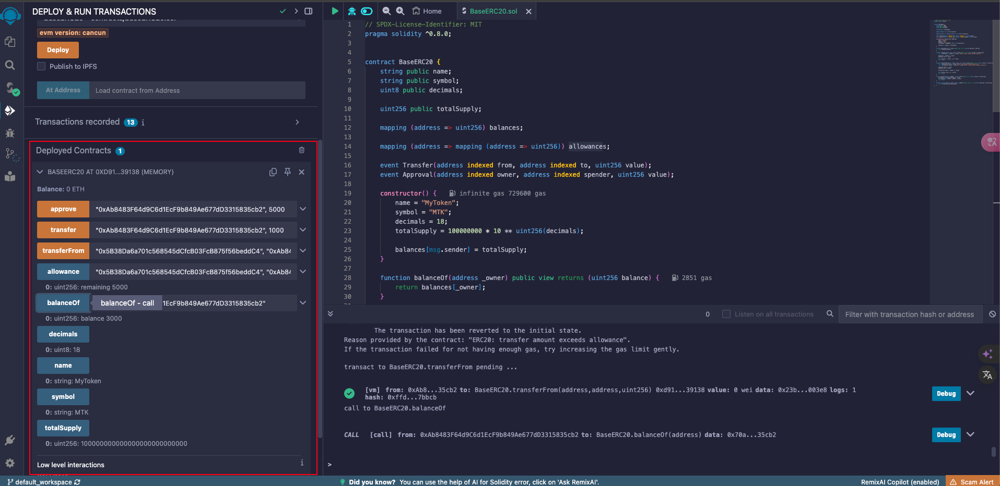

# 7-W1D7-项目实战：简单代币合约

**目标：完成第一个简单项目，编写一个ERC-20代币**

- 学习ERC-20标准
- 编写符合ERC-20标准的简单代币合约
- 在Remix中部署并测试

- **笔记**
- 学习ERC-20标准
    - [**ERC20 代币标准**](https://decert.me/tutorial/solidity/solidity-practice/erc20)
        - **什么是 ERC20?[​](https://decert.me/tutorial/solidity/solidity-practice/erc20#%E4%BB%80%E4%B9%88%E6%98%AF-erc20)**
            
            [ERC20](https://eips.ethereum.org/EIPS/eip-20) 是 Ethereum 网络上最出名且应用最广的代币标准之一。它提供了一个统一的接口标准，用于创建可互换代币，这些代币可以用来代表任何事物，从货币到积分等。
            
            该标准定义了一组 API（应用程序编程接口），涉及到代币在智能合约中的转移方式，如何获取数据（比如各账户的代币余额），以及如何接收、记录和使用这些代币。
            
        - **ERC20 核心方法和事件[​](https://decert.me/tutorial/solidity/solidity-practice/erc20#erc20-%E6%A0%B8%E5%BF%83%E6%96%B9%E6%B3%95%E5%92%8C%E4%BA%8B%E4%BB%B6)**
            
            ERC20 标准主要定义了以下几个方法和两个事件：
            
            方法：
            
            1. `name() public view returns (string)`：可选；返回一个字符串值，表示代币的名称
            2. `symbol() public view returns (string)`：可选；返回一个字符串值，表示代币的简写或缩写。
            3. `decimals() public view returns (uint8)`：可选；返回一个 uint8 类型的值，表示代币可以分割到的小数位数。许多代币选择`18`为其小数值，因为这是 Ether(ETH) 使用的小数位数
            4. `totalSupply() public view returns (uint256)`：返回代币的总供应量
            5. `balanceOf(address _owner) public view returns (uint256 balance)`：返回特定地址(_owner)的代币余额
            6. `transfer(address _to, uint256 _value) public returns (bool success)`：从调用者的地址转移 _value 量的代币到地址 _to，成功返回 true
            7. `transferFrom(address _from, address _to, uint256 _value) public returns (bool success)`：允许 _spender 从 _from 转移 _value 量的代币到 _to
            8. `approve(address _spender, uint256 _value) public returns (bool success)`：允许 _spender 从调用者的账户多次取回总共 _value 量的代币
            9. `allowance(address _owner, address _spender) public view returns (uint256 remaining)`：返回 _spender 仍然被允许从 _owner 提取的代币数量
            
            事件：
            
            1. `Transfer(address indexed _from, address indexed _to, uint256 _value)`：在代币被转移时触发。
            2. `Approval(address indexed _owner, address indexed _spender, uint256 _value)`：在调用 approve 方法时触发。
            
- 编写符合ERC-20标准的简单代币合约
    - [**编写一个简单的 ERC20 代币合约**](https://decert.me/tutorial/solidity/solidity-practice/erc20#%E7%BC%96%E5%86%99%E4%B8%80%E4%B8%AA%E7%AE%80%E5%8D%95%E7%9A%84-erc20-%E4%BB%A3%E5%B8%81%E5%90%88%E7%BA%A6)
        
        ```solidity
        // SPDX-License-Identifier: MIT
        pragma solidity ^0.8.0;
        
        // 定义一个基于ERC20标准的代币合约
        contract BaseERC20 {
            // 代币名称
            string public name; 
            // 代币符号
            string public symbol; 
            // 代币小数位数
            uint8 public decimals; 
        
            // 代币总供应量
            uint256 public totalSupply; 
        
            // 记录每个地址的代币余额
            mapping (address => uint256) balances; 
        
            // 记录每个地址授权给其他地址的代币额度
            mapping (address => mapping (address => uint256)) allowances; 
        
            // 事件：代币转移
            event Transfer(address indexed from, address indexed to, uint256 value);
            // 事件：代币授权
            event Approval(address indexed owner, address indexed spender, uint256 value);
        
            // 构造函数：初始化代币信息
            constructor() {
                name = "MyToken"; // 设置代币名称
                symbol = "MTK";   // 设置代币符号
                decimals = 18;    // 设置代币小数位数
                // 设置总供应量，并分配给合约创建者
                totalSupply = 100000000 * 10 ** uint256(decimals);
                balances[msg.sender] = totalSupply;  
            }
        
            // 查询指定地址的代币余额
            function balanceOf(address _owner) public view returns (uint256 balance) {
                return balances[_owner];    
            }
        
            // 转账：从当前地址向指定地址转移代币
            function transfer(address _to, uint256 _value) public returns (bool success) {
                // 检查当前地址余额是否足够
                require(balances[msg.sender] >= _value, "ERC20: transfer amount exceeds balance");
        
                // 从当前地址扣除代币
                balances[msg.sender] -= _value;    
                // 向目标地址增加代币
                balances[_to] += _value;   
        
                // 触发转账事件
                emit Transfer(msg.sender, _to, _value);  
                return true;   
            }
        
            // 授权转账：从指定地址向另一个地址转移代币
            function transferFrom(address _from, address _to, uint256 _value) public returns (bool success) {
                // 检查_from地址余额是否足够
                require(balances[_from] >= _value, "ERC20: transfer amount exceeds balance");
                // 检查授权额度是否足够
                require(allowances[_from][msg.sender] >= _value,"ERC20: transfer amount exceeds allowance");
        
                // 从_from地址扣除代币
                balances[_from] -= _value; 
                // 向_to地址增加代币
                balances[_to] += _value; 
        
                // 扣除授权额度
                allowances[_from][msg.sender] -= _value;
                
                // 触发转账事件
                emit Transfer(_from, _to, _value); 
                return true; 
            }
        
            // 授权：允许_spender地址从当前地址转移代币
            function approve(address _spender, uint256 _value) public returns (bool success) {
                // 设置授权额度
                allowances[msg.sender][_spender] = _value; 
                // 触发授权事件
                emit Approval(msg.sender, _spender, _value); 
                return true; 
            }
        
            // 查询授权额度：查询_owner地址授权给_spender地址的代币额度
            function allowance(address _owner, address _spender) public view returns (uint256 remaining) {
                return allowances[_owner][_spender];
            }
        }
        
        ```
        
- 在Remix中部署并测试
    
    